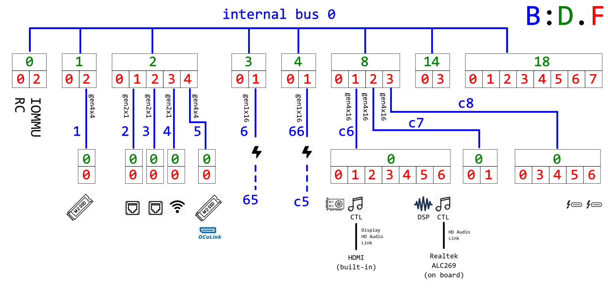
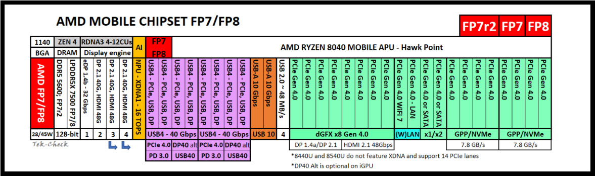
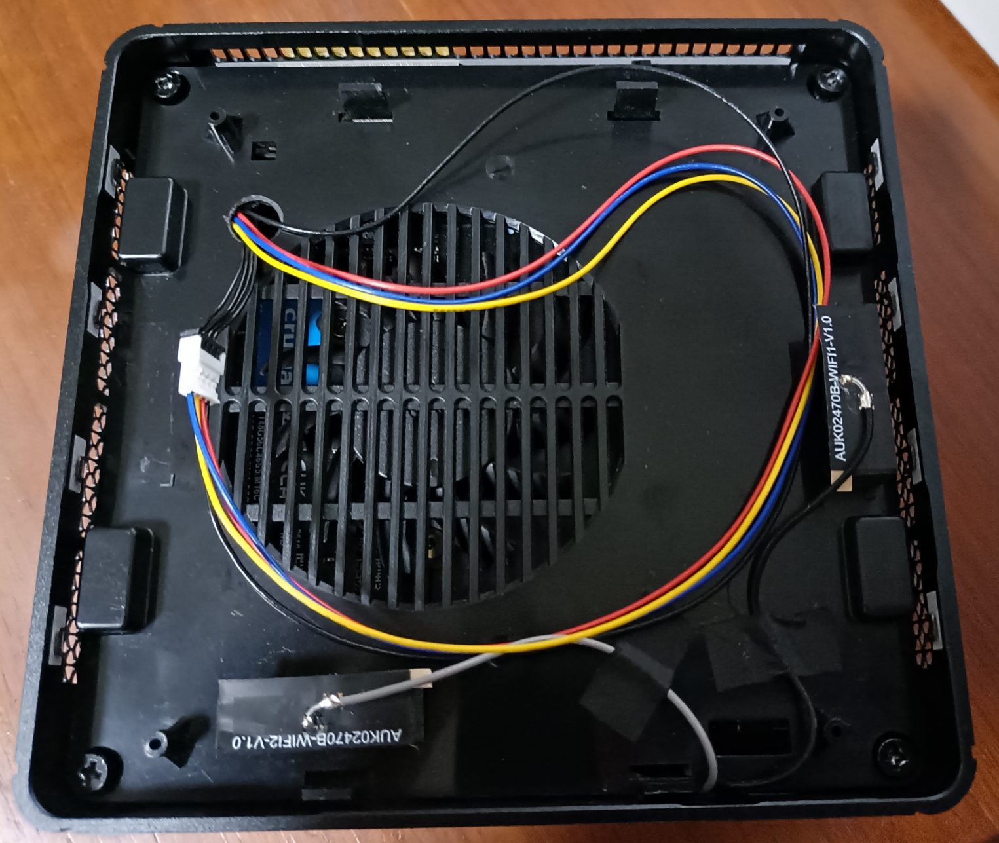

# Background

- Created: 2025.6.29
- Last Update: 2025.7.2

After testing iGPU passthrough on the [HP EliteDesk 800 G4 DM](https://github.com/xiongyw/docs/blob/master/pve-8.4-1_hp-elitedesk-800-g4-dm.md) and [Lenovo M920x Tiny](https://github.com/xiongyw/docs/blob/master/pve-8.4-1_lenovo-m920x-tiny.md) (both with Intel UHD Graphics 630), I decided to test AMD's iGPU. I purchased a Mini PC, the [Minisforum `UM880PRO`](https://www.minisforum.com/pages/product-info), equipped with an AMD Ryzen 7 8845HS CPU and integrated an iGPU `Radeon 780m Graphics (Phoenix3)`.

The process was less smooth than expected due to the notorious **AMD Reset Bug**, which has palgued AMD's consumer GPUs for generations. Despite community efforts (e.g, [vendor-reset](https://github.com/gnif/vendor-reset) and [RadeonResetBugFix](https://github.com/inga-lovinde/RadeonResetBugFix)), no universal solution exists. It seems that resolving this issue often involves trial and error -- and a bit of luck.

Below, I'll first outline the "solution" for my Ryzen 7 8845HS, followed with some details (and rationale).

# TL;DR

The symptom of the "AMD Reset Bug" is that the VM only starts correctly once after a host reboot. Subsequent attempts fail until the host reboots again.

The Goals:

- a) From within Windows VM, `Restart` and `Shutdown` works gracefully and repeatedly;
- b) From PVE host, `qm start <vmid>`, `qm stop <vmid>` and `qm reboot <vmid>` works gracefully and repeatedly.

My current "solution" was inspired by [this post](https://forum.level1techs.com/t/navi-reset-kernel-patch/147547/83), which combined two workarounds:
- Windows VM side: startup/shutdown scripts which enables/disables iGPU and audio device using `devcon.exe`;
- PVE Host side:  a hook script to remove/rescan pcie devices, during `qm start/stop`; 

Note: the original post also mentioned a step for putting the host into "Suspend to RAM" state for several seconds...but it wasn't necessary in my setup.

## `devcon` setup in VM

I use [`Devcon.Installer.exe`](https://github.com/Drawbackz/DevCon-Installer) to install `devcon` following the instruction [here](https://superuser.com/a/1751153) for my Windows 11 Pro. The DevCon Version chosen was "Windows 11 version 23H2" with Architecture "X64", and I installed it (one executable `devcon.exe`) to `C:\devcon\`.

For the startup/shutdown scripts, I followed this [post](https://forum.level1techs.com/t/linux-host-windows-guest-gpu-passthrough-reinitialization-fix/121097). The scripts for my setup is as below:

```
PS C:\devcon> cat .\disable-gpu.bat
devcon.exe disable "PCI\VEN_1002&DEV_1900*"
devcon.exe disable "HDAUDIO\FUNC_01&VEN_1002&DEV_AA01*"

PS C:\devcon> cat .\enable-gpu.bat
devcon.exe enable "PCI\VEN_1002&DEV_1900*"
devcon.exe enable "HDAUDIO\FUNC_01&VEN_1002&DEV_AA01*"
```

After this step, goal `a)` was achieved, while goal `b)` was not.

## VM hook on Host

The following is my hook script for Windows VM (vmid=100):

```
# cat /var/lib/vz/snippets/vm100-hooks.sh
#!/usr/bin/bash

# ref: https://gist.github.com/kiler129/215e2c8de853209ca429ad5ed40ce128

set -e -o errexit -o pipefail -o nounset


# Do not modify these variables (set by Proxmox when calling the script)
vmId="$1"
runPhase="$2"
echo ">>> Entering $runPhase on VM=$vmId" > /dev/kmsg

case "$runPhase" in
    pre-start)
      echo "### rescan pcie bus..." > /dev/kmsg
      echo 1 > /sys/bus/pci/rescan
      sleep 2
      ;;
    post-start)
      ;;
    pre-stop)
      echo "### remove gpu/snd devices..." > /dev/kmsg
      GFX_PATH=$(dirname $(grep -l "PCI_ID=1002:1900" /sys/bus/pci/devices/*/uevent))
      SND_PATH=$(dirname $(grep -l "PCI_ID=1002:1640" /sys/bus/pci/devices/*/uevent))
      echo 1 > ${GFX_PATH}/remove
      sleep 1
      echo 1 > ${SND_PATH}/remove
      sleep 1
      ;;
    post-stop)
      echo "### rescan pcie bus..." > /dev/kmsg
      echo 1 > /sys/bus/pci/rescan
      sleep 2
      ;;
    *)
      echo "### Unknown run phase \"$runPhase\"!" > /dev/kmsg
      ;;
esac

echo "<<< Leaving $runPhase on VM=$vmId" > /dev/kmsg
```

Install the hook for the vm:

```
$ sudo chmod +x /var/lib/vz/snippets/vm100-hooks.sh
$ sudo qm set 100 --hookscript local:snippets/vm100-hooks.sh
```

Now goal `b)` was also achieved.


## vm config

The following is my vm config:

```
# qm config 100
agent: 1
bios: ovmf
boot: order=scsi0;ide1
cores: 4
cpu: host
efidisk0: tank:vm-100-disk-0,efitype=4m,pre-enrolled-keys=1,size=1M
hookscript: local:snippets/vm100-hooks.sh
hostpci0: 0000:c5:00.0,pcie=1,x-vga=1,romfile=vbios_1002_1900.bin
hostpci1: 0000:c5:00.1,pcie=1,romfile=AMDGopDriver_8845hs.rom
ide0: none,media=cdrom
ide1: none,media=cdrom
machine: pc-q35-9.2+pve1
memory: 32768
meta: creation-qemu=9.2.0,ctime=1751205760
name: win11
net0: virtio=BC:24:11:65:28:1F,bridge=lanbr
numa: 0
onboot: 1
ostype: win11
parent: after_add_devcon_scripts
scsi0: tank:vm-100-disk-2,cache=writeback,discard=on,size=128G,ssd=1
scsihw: virtio-scsi-pci
smbios1: uuid=2685ce19-6d14-4bc8-a08a-70699408edfc
sockets: 1
tpmstate0: tank:vm-100-disk-1,size=4M,version=v2.0
usb0: host=062a:4101
vga: none
vmgenid: 4dee25b3-2e2d-4948-8151-8e8b7758a410
```

## `dmesg` logs

Below are `dmesg` logs for different start/restart/shutdown scenarios.

- VM's first time auto-boot after host reboot:

    ```
    [   13.592921] >>> Entering pre-start on VM=100
    [   13.592965] ### rescan pcie bus...
    [   15.624007] <<< Leaving pre-start on VM=100
    [   16.232373] tap100i0: entered promiscuous mode
    [   16.246950] lanbr: port 2(tap100i0) entered blocking state
    [   16.246953] lanbr: port 2(tap100i0) entered disabled state
    [   16.246964] tap100i0: entered allmulticast mode
    [   16.247036] lanbr: port 2(tap100i0) entered blocking state
    [   16.247038] lanbr: port 2(tap100i0) entered forwarding state
    [   17.947173] vfio-pci 0000:c5:00.0: enabling device (0002 -> 0003)
    [   17.963724] vfio-pci 0000:c5:00.1: enabling device (0000 -> 0002)
    [   18.240917] >>> Entering post-start on VM=100
    [   18.240964] <<< Leaving post-start on VM=100
    [   27.377659] usb 1-2.1: reset full-speed USB device number 5 using xhci_hcd
    ```

- Restart VM from within VM:

    ```
    [  189.874546] usb 1-2.1: reset full-speed USB device number 5 using xhci_hcd
    [  196.434537] usb 1-2.1: reset full-speed USB device number 5 using xhci_hcd
    ```

- Shutdown VM from within VM:

    ```
    [  285.387374]  zd32: p1 p2 p3 p4
    [  285.489849] tap100i0: left allmulticast mode
    [  285.489867] lanbr: port 2(tap100i0) entered disabled state
    [  285.650769] usb 1-2.1: reset full-speed USB device number 5 using xhci_hcd
    [  285.816992] input: MOSART Semi. 2.4G Keyboard Mouse as /devices/pci0000:00/0000:00:08.1/0000:c5:00.3/usb1/1-2/1-2.1/1-2.1:1.0/0003:062A:4101.0004/input/input9
    [  285.914853] hid-generic 0003:062A:4101.0004: input,hidraw1: USB HID v1.10 Keyboard [MOSART Semi. 2.4G Keyboard Mouse] on usb-0000:c5:00.3-2.1/input0
    [  285.918994] input: MOSART Semi. 2.4G Keyboard Mouse as /devices/pci0000:00/0000:00:08.1/0000:c5:00.3/usb1/1-2/1-2.1/1-2.1:1.1/0003:062A:4101.0005/input/input10
    [  285.919223] input: MOSART Semi. 2.4G Keyboard Mouse Consumer Control as /devices/pci0000:00/0000:00:08.1/0000:c5:00.3/usb1/1-2/1-2.1/1-2.1:1.1/0003:062A:4101.0005/input/input11
    [  285.971109] input: MOSART Semi. 2.4G Keyboard Mouse System Control as /devices/pci0000:00/0000:00:08.1/0000:c5:00.3/usb1/1-2/1-2.1/1-2.1:1.1/0003:062A:4101.0005/input/input12
    [  285.971243] input: MOSART Semi. 2.4G Keyboard Mouse as /devices/pci0000:00/0000:00:08.1/0000:c5:00.3/usb1/1-2/1-2.1/1-2.1:1.1/0003:062A:4101.0005/input/input13
    [  285.971432] hid-generic 0003:062A:4101.0005: input,hiddev1,hidraw2: USB HID v1.10 Mouse [MOSART Semi. 2.4G Keyboard Mouse] on usb-0000:c5:00.3-2.1/input1
    ```

- `qm start 100` from host:

    ```
    [  377.035162] >>> Entering pre-start on VM=100
    [  377.035202] ### rescan pcie bus...
    [  379.081262] <<< Leaving pre-start on VM=100
    [  379.592472] tap100i0: entered promiscuous mode
    [  379.607770] lanbr: port 2(tap100i0) entered blocking state
    [  379.607773] lanbr: port 2(tap100i0) entered disabled state
    [  379.607784] tap100i0: entered allmulticast mode
    [  379.607852] lanbr: port 2(tap100i0) entered blocking state
    [  379.607854] lanbr: port 2(tap100i0) entered forwarding state
    [  381.585312] >>> Entering post-start on VM=100
    [  381.585356] <<< Leaving post-start on VM=100
    [  389.715484] usb 1-2.1: reset full-speed USB device number 5 using xhci_hcd
    ```

    Note that in this case, the command terminal still reports reset error, although the VM starts correctly.

    ```
    root@d12pve:/home/bruin# qm start 100
    error writing '1' to '/sys/bus/pci/devices/0000:c5:00.0/reset': Inappropriate ioctl for device
    failed to reset PCI device '0000:c5:00.0', but trying to continue as not all devices need a reset
    swtpm_setup: Not overwriting existing state file.
    ```

- `qm stop 100` from host:

    ```
    [  558.438014] >>> Entering pre-stop on VM=100
    [  558.438057] ### remove gpu/snd devices...
    [  558.443876] vfio-pci 0000:c5:00.0: Relaying device request to user (#0)
    [  559.861671] vfio-pci 0000:c5:00.0: vgaarb: VGA decodes changed: olddecodes=io+mem,decodes=io+mem:owns=none
    [  560.863459] vfio-pci 0000:c5:00.1: Relaying device request to user (#0)
    [  572.723964] <<< Leaving pre-stop on VM=100
    [  573.004210]  zd32: p1 p2 p3 p4
    [  573.116681] tap100i0: left allmulticast mode
    [  573.116706] lanbr: port 2(tap100i0) entered disabled state
    [  573.300203] usb 1-2.1: reset full-speed USB device number 5 using xhci_hcd
    [  573.466426] input: MOSART Semi. 2.4G Keyboard Mouse as /devices/pci0000:00/0000:00:08.1/0000:c5:00.3/usb1/1-2/1-2.1/1-2.1:1.0/0003:062A:4101.0006/input/input14
    [  573.550015] hid-generic 0003:062A:4101.0006: input,hidraw1: USB HID v1.10 Keyboard [MOSART Semi. 2.4G Keyboard Mouse] on usb-0000:c5:00.3-2.1/input0
    [  573.554572] input: MOSART Semi. 2.4G Keyboard Mouse as /devices/pci0000:00/0000:00:08.1/0000:c5:00.3/usb1/1-2/1-2.1/1-2.1:1.1/0003:062A:4101.0007/input/input15
    [  573.554731] input: MOSART Semi. 2.4G Keyboard Mouse Consumer Control as /devices/pci0000:00/0000:00:08.1/0000:c5:00.3/usb1/1-2/1-2.1/1-2.1:1.1/0003:062A:4101.0007/input/input16
    [  573.607143] input: MOSART Semi. 2.4G Keyboard Mouse System Control as /devices/pci0000:00/0000:00:08.1/0000:c5:00.3/usb1/1-2/1-2.1/1-2.1:1.1/0003:062A:4101.0007/input/input17
    [  573.607382] input: MOSART Semi. 2.4G Keyboard Mouse as /devices/pci0000:00/0000:00:08.1/0000:c5:00.3/usb1/1-2/1-2.1/1-2.1:1.1/0003:062A:4101.0007/input/input18
    [  573.607663] hid-generic 0003:062A:4101.0007: input,hiddev1,hidraw2: USB HID v1.10 Mouse [MOSART Semi. 2.4G Keyboard Mouse] on usb-0000:c5:00.3-2.1/input1
    [  574.171972] >>> Entering post-stop on VM=100
    [  574.172024] ### rescan pcie bus...
    [  574.215275] pci 0000:c5:00.0: [1002:1900] type 00 class 0x030000 PCIe Legacy Endpoint
    [  574.215312] pci 0000:c5:00.0: BAR 0 [mem 0x7c00000000-0x7c0fffffff 64bit pref]
    [  574.215317] pci 0000:c5:00.0: BAR 2 [mem 0xdc000000-0xdc1fffff 64bit pref]
    [  574.215319] pci 0000:c5:00.0: BAR 4 [io  0xd000-0xd0ff]
    [  574.215322] pci 0000:c5:00.0: BAR 5 [mem 0xdc500000-0xdc57ffff]
    [  574.215399] pci 0000:c5:00.0: PME# supported from D1 D2 D3hot D3cold
    [  574.215647] pci 0000:c5:00.0: Adding to iommu group 18
    [  574.215686] pci 0000:c5:00.0: vgaarb: setting as boot VGA device
    [  574.215688] pci 0000:c5:00.0: vgaarb: bridge control possible
    [  574.215689] pci 0000:c5:00.0: vgaarb: VGA device added: decodes=io+mem,owns=none,locks=none
    [  574.215723] pci 0000:c5:00.1: [1002:1640] type 00 class 0x040300 PCIe Legacy Endpoint
    [  574.215753] pci 0000:c5:00.1: BAR 0 [mem 0xdc5c8000-0xdc5cbfff]
    [  574.215824] pci 0000:c5:00.1: PME# supported from D1 D2 D3hot D3cold
    [  574.216017] pci 0000:c5:00.1: Adding to iommu group 19
    [  574.216413] pci 0000:c5:00.0: BAR 0 [mem 0x7c00000000-0x7c0fffffff 64bit pref]: assigned
    [  574.216428] pci 0000:c5:00.0: BAR 2 [mem 0xdc000000-0xdc1fffff 64bit pref]: assigned
    [  574.216435] pci 0000:c5:00.0: BAR 5 [mem 0xdc500000-0xdc57ffff]: assigned
    [  574.216439] pci 0000:c5:00.1: BAR 0 [mem 0xdc5c8000-0xdc5cbfff]: assigned
    [  574.216442] pci 0000:c5:00.0: BAR 4 [io  0xd000-0xd0ff]: assigned
    [  574.216554] vfio-pci 0000:c5:00.0: vgaarb: deactivate vga console
    [  574.216558] vfio-pci 0000:c5:00.0: vgaarb: VGA decodes changed: olddecodes=io+mem,decodes=io+mem:owns=none
    [  574.217006] pci 0000:c5:00.1: D0 power state depends on 0000:c5:00.0
    [  576.244148] <<< Leaving post-stop on VM=100
    ```

    Note that this time, the command terminal reports an error, which I don't have clue yet. But the error seems no harm.

    ```
    root@d12pve:/home/bruin# qm stop 100
    no PCI device found for '0000:c5:00.0'
    ```

- `qm start 100` again from host:

    ```
    [  737.995262] >>> Entering pre-start on VM=100
    [  737.995303] ### rescan pcie bus...
    [  740.041203] <<< Leaving pre-start on VM=100
    [  740.553833] tap100i0: entered promiscuous mode
    [  740.569075] lanbr: port 2(tap100i0) entered blocking state
    [  740.569079] lanbr: port 2(tap100i0) entered disabled state
    [  740.569094] tap100i0: entered allmulticast mode
    [  740.569163] lanbr: port 2(tap100i0) entered blocking state
    [  740.569164] lanbr: port 2(tap100i0) entered forwarding state
    [  742.537422] >>> Entering post-start on VM=100
    [  742.537465] <<< Leaving post-start on VM=100
    [  751.125142] usb 1-2.1: reset full-speed USB device number 5 using xhci_hcd
    ```


The `dmesg` log shows that Restart/Shutdown from VM does not trigger the VM hook, suggesting that this two methods are kind of complementary.

# Setup Plan

The Mini PC has 96G DDR5 5600 and [2TB Crucial P3 Plus NVMe SSD](https://www.crucial.com/ssd/p3-plus/ct2000p3pssd8), with Windows 11 pre-installed. The plan is to dual boot Windows and PVE, and use ZFS for thin-provisioning and snapshot (instead of `lvm`). 

Why keeping the native windows as the it's supposed to be running in a VM? Several reasons:
- I am not sure if iGPU test will be successful;
- I need a native windows to compare with the VM instance, for troubleshooting and benchmarking;

It seems that PVE installer will take the whole disk with a default parition layout, so for dual boot with customized partition layout, I need to follow the instruction [here](https://pve.proxmox.com/wiki/Install_Proxmox_VE_on_Debian_12_Bookworm) to first install debian 12 and then install Proxmox VE on top of debian.

It also seems that ZFS has a better performance with 4KB sector size as compared to 512B sector size. The SSD supports 4KB sector size but it's using 512B sector size shipped. I need to change the sector size to 4KB, meaning all existing data (the pre-installed Windows 11) on the SSD will be lost (which is ok to me).

The overall disk layout (after setup is done):

```
root@d12pve:~# fdisk -l /dev/nvme0n1
Disk /dev/nvme0n1: 1.82 TiB, 2000398934016 bytes, 488378646 sectors
Disk model: CT2000P3PSSD8
Units: sectors of 1 * 4096 = 4096 bytes
Sector size (logical/physical): 4096 bytes / 4096 bytes
I/O size (minimum/optimal): 4096 bytes / 4096 bytes
Disklabel type: gpt
Disk identifier: F825F822-3E6D-4C7E-AAA2-2C2C7D9E42D9

Device             Start       End   Sectors   Size Type
/dev/nvme0n1p1       256     77055     76800   300M EFI System
/dev/nvme0n1p2     77056     81151      4096    16M Microsoft reserved
/dev/nvme0n1p3     81152  67190015  67108864   256G Microsoft basic data
/dev/nvme0n1p4  67190016 129690111  62500096 238.4G Linux filesystem
/dev/nvme0n1p5 129690112 488378623 358688512   1.3T Linux filesystem

root@d12pve:~# lsblk
NAME        MAJ:MIN RM   SIZE RO TYPE MOUNTPOINTS
zd0         230:0    0     1M  0 disk
zd16        230:16   0     4M  0 disk
zd32        230:32   0   128G  0 disk
├─zd32p1    230:33   0   100M  0 part
├─zd32p2    230:34   0    16M  0 part
├─zd32p3    230:35   0 127.2G  0 part
└─zd32p4    230:36   0   710M  0 part
nvme0n1     259:0    0   1.8T  0 disk
├─nvme0n1p1 259:1    0   300M  0 part /boot/efi
├─nvme0n1p2 259:2    0    16M  0 part
├─nvme0n1p3 259:3    0   256G  0 part
├─nvme0n1p4 259:4    0 238.4G  0 part /
└─nvme0n1p5 259:5    0   1.3T  0 part

root@d12pve:~# zpool status
  pool: tank
 state: ONLINE
config:

        NAME         STATE     READ WRITE CKSUM
        tank         ONLINE       0     0     0
          nvme0n1p5  ONLINE       0     0     0

errors: No known data errors

root@d12pve:~# zfs list
NAME                 USED  AVAIL  REFER  MOUNTPOINT
tank                 182G  1.12T   127G  /tank
tank/vm-100-disk-0   592K  1.12T   124K  -
tank/vm-100-disk-1   384K  1.12T    64K  -
tank/vm-100-disk-2  54.7G  1.12T  45.7G  -
```

# Change sector size

I followed the instruction [here](https://wiki.archlinux.org/title/Advanced_Format#Setting_native_sector_size) to change the SSD sector size. There were reports that 4KB sectors size may cause stability issues on some SSD brands...so far I did not experience issues with 4KB sector size on my [`CT2000P3PSSD8`](https://www.crucial.com/ssd/p3-plus/ct2000p3pssd8).

Boot into Linux from an external HDD, do the following, then the sector size is changed to 4KB and the disk is empty (no partition table, no nothing):

```
root@hbs:~# nvme id-ns -H /dev/nvme0n1
NVME Identify Namespace 1:
nsze    : 0xe8e088b0
ncap    : 0xe8e088b0
nuse    : 0xe8e088b0
nsfeat  : 0x18
  [4:4] : 0x1   NPWG, NPWA, NPDG, NPDA, and NOWS are Supported
  [3:3] : 0x1   NGUID and EUI64 fields if non-zero, Never Reused
  [2:2] : 0     Deallocated or Unwritten Logical Block error Not Supported
  [1:1] : 0     Namespace uses AWUN, AWUPF, and ACWU
  [0:0] : 0     Thin Provisioning Not Supported

nlbaf   : 1
flbas   : 0
  [6:5] : 0     Most significant 2 bits of Current LBA Format Selected
  [4:4] : 0     Metadata Transferred in Separate Contiguous Buffer
  [3:0] : 0     Least significant 4 bits of Current LBA Format Selected

mc      : 0
  [1:1] : 0     Metadata Pointer Not Supported
  [0:0] : 0     Metadata as Part of Extended Data LBA Not Supported

dpc     : 0
  [4:4] : 0     Protection Information Transferred as Last Bytes of Metadata Not Supported
  [3:3] : 0     Protection Information Transferred as First Bytes of Metadata Not Supported
  [2:2] : 0     Protection Information Type 3 Not Supported
  [1:1] : 0     Protection Information Type 2 Not Supported
  [0:0] : 0     Protection Information Type 1 Not Supported

dps     : 0
  [3:3] : 0     Protection Information is Transferred as Last Bytes of Metadata
  [2:0] : 0     Protection Information Disabled

nmic    : 0
  [0:0] : 0     Namespace Multipath Not Capable

rescap  : 0
  [7:7] : 0     Ignore Existing Key - Used as defined in revision 1.2.1 or earlier
  [6:6] : 0     Exclusive Access - All Registrants Not Supported
  [5:5] : 0     Write Exclusive - All Registrants Not Supported
  [4:4] : 0     Exclusive Access - Registrants Only Not Supported
  [3:3] : 0     Write Exclusive - Registrants Only Not Supported
  [2:2] : 0     Exclusive Access Not Supported
  [1:1] : 0     Write Exclusive Not Supported
  [0:0] : 0     Persist Through Power Loss Not Supported

fpi     : 0x80
  [7:7] : 0x1   Format Progress Indicator Supported
  [6:0] : 0     Format Progress Indicator (Remaining 0%)

dlfeat  : 1
  [4:4] : 0     Guard Field of Deallocated Logical Blocks is set to 0xFFFF
  [3:3] : 0     Deallocate Bit in the Write Zeroes Command is Not Supported
  [2:0] : 0x1   Bytes Read From a Deallocated Logical Block and its Metadata are 0x00

nawun   : 0
nawupf  : 0
nacwu   : 0
nabsn   : 0
nabo    : 0
nabspf  : 0
noiob   : 0
nvmcap  : 0
npwg    : 7
npwa    : 7
npdg    : 7
npda    : 7
nows    : 7
mssrl   : 0
mcl     : 0
msrc    : 0
nulbaf  : 0
anagrpid: 0
nsattr  : 0
nvmsetid: 0
endgid  : 0
nguid   : 000000000000000100a075254e93c6e5
eui64   : 00a075014e93c6e5
LBA Format  0 : Metadata Size: 0   bytes - Data Size: 512 bytes - Relative Performance: 0 Best (in use)
LBA Format  1 : Metadata Size: 0   bytes - Data Size: 4096 bytes - Relative Performance: 0 Best

root@hbs:~# nvme format --lbaf=1 /dev/nvme0n1
You are about to format nvme0n1, namespace 0x1.
WARNING: Format may irrevocably delete this device's data.
You have 10 seconds to press Ctrl-C to cancel this operation.

Use the force [--force] option to suppress this warning.
Sending format operation ...
Success formatting namespace:1

root@hbs:~# nvme id-ns -H /dev/nvme0n1
NVME Identify Namespace 1:
nsze    : 0x1d1c1116
ncap    : 0x1d1c1116
nuse    : 0x1d1c1116
nsfeat  : 0x18
  [4:4] : 0x1   NPWG, NPWA, NPDG, NPDA, and NOWS are Supported
  [3:3] : 0x1   NGUID and EUI64 fields if non-zero, Never Reused
  [2:2] : 0     Deallocated or Unwritten Logical Block error Not Supported
  [1:1] : 0     Namespace uses AWUN, AWUPF, and ACWU
  [0:0] : 0     Thin Provisioning Not Supported

nlbaf   : 1
flbas   : 0x1
  [6:5] : 0     Most significant 2 bits of Current LBA Format Selected
  [4:4] : 0     Metadata Transferred in Separate Contiguous Buffer
  [3:0] : 0x1   Least significant 4 bits of Current LBA Format Selected

mc      : 0
  [1:1] : 0     Metadata Pointer Not Supported
  [0:0] : 0     Metadata as Part of Extended Data LBA Not Supported

dpc     : 0
  [4:4] : 0     Protection Information Transferred as Last Bytes of Metadata Not Supported
  [3:3] : 0     Protection Information Transferred as First Bytes of Metadata Not Supported
  [2:2] : 0     Protection Information Type 3 Not Supported
  [1:1] : 0     Protection Information Type 2 Not Supported
  [0:0] : 0     Protection Information Type 1 Not Supported

dps     : 0
  [3:3] : 0     Protection Information is Transferred as Last Bytes of Metadata
  [2:0] : 0     Protection Information Disabled

nmic    : 0
  [0:0] : 0     Namespace Multipath Not Capable

rescap  : 0
  [7:7] : 0     Ignore Existing Key - Used as defined in revision 1.2.1 or earlier
  [6:6] : 0     Exclusive Access - All Registrants Not Supported
  [5:5] : 0     Write Exclusive - All Registrants Not Supported
  [4:4] : 0     Exclusive Access - Registrants Only Not Supported
  [3:3] : 0     Write Exclusive - Registrants Only Not Supported
  [2:2] : 0     Exclusive Access Not Supported
  [1:1] : 0     Write Exclusive Not Supported
  [0:0] : 0     Persist Through Power Loss Not Supported

fpi     : 0x80
  [7:7] : 0x1   Format Progress Indicator Supported
  [6:0] : 0     Format Progress Indicator (Remaining 0%)

dlfeat  : 1
  [4:4] : 0     Guard Field of Deallocated Logical Blocks is set to 0xFFFF
  [3:3] : 0     Deallocate Bit in the Write Zeroes Command is Not Supported
  [2:0] : 0x1   Bytes Read From a Deallocated Logical Block and its Metadata are 0x00

nawun   : 0
nawupf  : 0
nacwu   : 0
nabsn   : 0
nabo    : 0
nabspf  : 0
noiob   : 0
nvmcap  : 0
npwg    : 0
npwa    : 0
npdg    : 0
npda    : 0
nows    : 0
mssrl   : 0
mcl     : 0
msrc    : 0
nulbaf  : 0
anagrpid: 0
nsattr  : 0
nvmsetid: 0
endgid  : 0
nguid   : 000000000000000100a075254e93c6e5
eui64   : 00a075014e93c6e5
LBA Format  0 : Metadata Size: 0   bytes - Data Size: 512 bytes - Relative Performance: 0 Best
LBA Format  1 : Metadata Size: 0   bytes - Data Size: 4096 bytes - Relative Performance: 0 Best (in use)

root@hbs:~# fdisk -l /dev/nvme0n1
Disk /dev/nvme0n1: 1.82 TiB, 2000398934016 bytes, 488378646 sectors
Disk model: CT2000P3PSSD8
Units: sectors of 1 * 4096 = 4096 bytes
Sector size (logical/physical): 4096 bytes / 4096 bytes
I/O size (minimum/optimal): 4096 bytes / 4096 bytes
```

At this moment, I don't manually create a partition table. Instead, I install a native Windows 11 which will create a partition table for me.

# Install Native Windows 11

There is no too much to say about Windows 11 install procedure. 

After that, I did the following steps:

- Install [MiniTool Partition Wizard Free](https://de.minitool.com/downloadcenter/) to remove the recovery partition and resize the C driver to 256G.
- Download um880pro drivers from [minisforum](https://www.minisforum.cn/zh-hans/pages/product-info), and install all of them.
- Install [图吧工具箱](https://www.tbtool.cn/index.html) for benchmarking and stress-testing.

Now the SSD partition table looks like this:

```
bruin@hbs ~ $ sudo fdisk -l /dev/nvme0n1
Disk /dev/nvme0n1: 1.82 TiB, 2000398934016 bytes, 488378646 sectors
Disk model: CT2000P3PSSD8
Units: sectors of 1 * 4096 = 4096 bytes
Sector size (logical/physical): 4096 bytes / 4096 bytes
I/O size (minimum/optimal): 4096 bytes / 4096 bytes
Disklabel type: gpt
Disk identifier: F825F822-3E6D-4C7E-AAA2-2C2C7D9E42D9

Device         Start      End  Sectors  Size Type
/dev/nvme0n1p1   256    77055    76800  300M EFI System
/dev/nvme0n1p2 77056    81151     4096   16M Microsoft reserved
/dev/nvme0n1p3 81152 67190015 67108864  256G Microsoft basic data
```

Make a backup of the windows partitions:

```
$ sudo dd if=/dev/nvme0n1 of=um880pro-win11-4kb-20250629.img bs=4096 count=67190016 status=progress
274184237056 bytes (274 GB, 255 GiB) copied, 249 s, 1.1 GB/s
67190016+0 records in
67190016+0 records out
275210305536 bytes (275 GB, 256 GiB) copied, 258.097 s, 1.1 GB/s
```

In case messed up, I can restore the native windows 11 by:

```
$ sudo dd if=um880pro-win11-4kb-20250629.img of=/dev/nvme0n1 bs=4096 status=progress
```

# Install Debian 12

There is no too much to say about Debian 12 install, I just followed the instruction [here](https://pve.proxmox.com/wiki/Install_Proxmox_VE_on_Debian_12_Bookworm).

Several points just to keep a record:

- iso: `debian-12.11.0-amd64-DVD-1.iso`.
- hostname: `d12pve`;
- root partition: 256G, Ext4;
- no swap partition;
- only install the "standard system utilities" and "SSH server" package;

## Reinstall grub

It seems that the grub was not correctly installed during debian 12 install. I reinstall it manually after booting into a Linux system from an external SSD. Use the following script to install `grub` in `chroot` environment:

```
$ cat chroot-grub-install.sh
#!/bin/bash

ESP_DEV=/dev/nvme0n1p1
ROOT_DEV=/dev/nvme0n1p4
ROOT_MNT=/mnt/dst
ESP_MNT=${ROOT_MNT}/boot/efi

TIMESTAMP=/tmp/timestamp
BOOTENTRY_OLD=/tmp/bootentry_old
BOOTENTRY_NEW=/tmp/bootentry_new
CMD_GRUB_INSTALL="grub-install --efi-directory=/boot/efi --boot-directory=/boot --no-uefi-secure-boot"
CMD_UPDATE_GRUB="update-grub"
CMD_DIFF_BOOTENTRY="diff ${BOOTENTRY_OLD} ${BOOTENTRY_NEW}"
CMD_UPDATE_INITRAMFS="update-initramfs -u"

# Parse command-line arguments
while [[ "$1" != "" ]]; do
    case $1 in
        --no-nvram)
            NO_NVRAM="yes"
            shift
            ;;
        --removable)
            USE_REMOVABLE="yes"
            shift
            ;;
        --verbose)
            VERBOSE="yes"
            shift
            ;;
        *)
            echo "Unknown option: $1"
            echo "Usage: $0 [--removable --no-nvram --verbose]"
            exit 1
            ;;
    esac
done

if [ "${USE_REMOVABLE}" = "yes" ]; then
    CMD_GRUB_INSTALL="${CMD_GRUB_INSTALL} --removable"
fi

if [ "${NO_NVRAM}" = "yes" ]; then
    CMD_GRUB_INSTALL="${CMD_GRUB_INSTALL} --no-nvram"
fi

if [ "${VERBOSE}" = "yes" ]; then
    CMD_GRUB_INSTALL="${CMD_GRUB_INSTALL} --verbose"
fi

mkdir -p ${ROOT_MNT}

# umount first (just in case)
sudo umount ${ESP_DEV}  2>/dev/null || true
sudo umount ${ROOT_DEV} 2>/dev/null || true
sudo umount ${ESP_MNT}  2>/dev/null || true
sudo umount ${ROOT_MNT} 2>/dev/null || true

# mount ROOT and ESP
sudo mount ${ROOT_DEV} ${ROOT_MNT}
mkdir -p ${ESP_MNT}
sudo mount ${ESP_DEV} ${ESP_MNT}

# bind-mount dev/proc/sys/run
sudo mount --bind /dev ${ROOT_MNT}/dev
sudo mount --bind /dev/pts ${ROOT_MNT}/dev/pts
sudo mount --bind /proc ${ROOT_MNT}/proc
sudo mount --bind /run ${ROOT_MNT}/run
sudo mount --bind /sys ${ROOT_MNT}/sys

efibootmgr -v > ${BOOTENTRY_OLD}

# chroot
sudo chroot ${ROOT_MNT} /bin/bash << EOF
echo "### entered chroot."

echo "### executing ${CMD_UPDATE_INITRAMFS}..."
${CMD_UPDATE_INITRAMFS}

echo "### executing ${CMD_GRUB_INSTALL}..."
touch ${TIMESTAMP} && sleep 1
${CMD_GRUB_INSTALL}
echo "Files created or modified by grub-install:"
find /boot -type f -newer ${TIMESTAMP}

# update /boot/grub/grub.cfg
echo "### executing ${CMD_UPDATE_GRUB}..."
touch ${TIMESTAMP} && sleep 1
${CMD_UPDATE_GRUB}
echo "Files created or modified by update-grub:"
find /boot -type f -newer ${TIMESTAMP}
EOF

efibootmgr -v > ${BOOTENTRY_NEW}

# tear down
echo "### exited chroot. tear down..."
echo "### nvram boot entry difference: ${CMD_DIFF_BOOTENTRY}:"
${CMD_DIFF_BOOTENTRY}

sudo umount ${ROOT_MNT}/dev/pts
sudo umount ${ROOT_MNT}/dev
sudo umount ${ROOT_MNT}/proc
sudo umount ${ROOT_MNT}/run
sudo umount ${ROOT_MNT}/sys/firmware/efi/efivars
sudo umount ${ROOT_MNT}/sys
sudo umount ${ESP_DEV}
sudo umount ${ROOT_DEV}
```

Now during power up, I can boot into `debian` by pressing `ESC` key to enter `BIOS -> BBS Menu` to select `debian (CT2000P3PSSD8)`. I want to set `debian` be the default OS to boot, but the boot order **cannot** be changed by `efibootmgr -o` (under Linux) or `bcfg boot mv <#1> <#2>` (under UEFI Shell), because the change does not persist during reboot. 

Although the `BIOS -> Setup -> Boot` has function for changing boot orders, `debian` is not shown as a boot candidate.

It seems that this version of the BIOS has bugs.

But at least `efibootmgr -n <#>` works...so a workaround is to add `@reboot efibootmgr -n $(efibootmgr|grep BootCurrent| cut -d' ' -f2)` in `root`'s crontab, thus in most cases the PC will boot into PVE by default.

# Install PVE

Again, just following the instruction [here](https://pve.proxmox.com/wiki/Install_Proxmox_VE_on_Debian_12_Bookworm) for the debian 12 config and pve install. A recap below:

- `apt install sudo binutils build-essential git tig htop tmux inxi nmon parted ranger ncdu inxi ripgrep libguestfs-tools vim mutt`
- update `/etc/hosts` to replace `127.0.1.1` with real ip address.
- `apt remove os-prober`
- `echo "deb [arch=amd64] http://download.proxmox.com/debian/pve bookworm pve-no-subscription" > /etc/apt/sources.list.d/pve-install-repo.list`
- `wget https://enterprise.proxmox.com/debian/proxmox-release-bookworm.gpg -O /etc/apt/trusted.gpg.d/proxmox-release-bookworm.gpg`
- `apt update && apt full-upgrade`
- `apt install proxmox-default-kernel`
- `systemctl reboot`
- `apt install proxmox-ve postfix open-iscsi chrony`
- `apt remove linux-image-amd64 'linux-image-6.1*'`
- `update-grub`

## Add ZFS

The idea is to put VM disks on ZFS, which supports thin-provisioning, snapshot, and other nice features (such as silent bit-rote detection, dedup, etc). Although ZFS is a RAM hog, ~90G system RAM should be ok for now.

With ZFS, VM disk should use raw format instead of `qcow2`, because "qcow2 on zfs" adds unnecessary overhead since ZFS already handles compression, snapshots, and thin-provisioning efficiently.

- use `fdisk` to create `/dev/nvme0n1p5`, taking the rest available space:

    ```
    root@d12pve:/home/bruin# fdisk -l /dev/nvme0n1
    Disk /dev/nvme0n1: 1.82 TiB, 2000398934016 bytes, 488378646 sectors
    Disk model: CT2000P3PSSD8
    Units: sectors of 1 * 4096 = 4096 bytes
    Sector size (logical/physical): 4096 bytes / 4096 bytes
    I/O size (minimum/optimal): 4096 bytes / 4096 bytes
    Disklabel type: gpt
    Disk identifier: F825F822-3E6D-4C7E-AAA2-2C2C7D9E42D9

    Device             Start       End   Sectors   Size Type
    /dev/nvme0n1p1       256     77055     76800   300M EFI System
    /dev/nvme0n1p2     77056     81151      4096    16M Microsoft reserved
    /dev/nvme0n1p3     81152  67190015  67108864   256G Microsoft basic data
    /dev/nvme0n1p4  67190016 129690111  62500096 238.4G Linux filesystem
    /dev/nvme0n1p5 129690112 488378623 358688512   1.3T Linux filesystem
    ```
- create a `zpool` named `tank`:

    ```
    root@d12pve:/home/bruin# zpool create tank /dev/nvme0n1p5
    root@d12pve:/home/bruin# zpool status
    pool: tank
    state: ONLINE
    config:

            NAME         STATE     READ WRITE CKSUM
            tank         ONLINE       0     0     0
            nvme0n1p5  ONLINE       0     0     0

    errors: No known data errors
    ```
- From pve webui, `Datacenter -> Storage -> Add -> ZFS`:
    - ID: `tank`
    - ZFS Pool: `tank`
    - Content: Disk image, Container
    - Thin provision: tick

- check `/etc/pve/storage.cfg`:

    ```
    bruin@d12pve:~$ sudo cat /etc/pve/storage.cfg
    dir: local
            path /var/lib/vz
            content images,vztmpl,snippets,iso,backup,rootdir
            prune-backups keep-all=1

    zfspool: tank
            pool tank
            content rootdir,images
            mountpoint /tank
            sparse 1
    ```

## Create bridges

The machine comes with two ethernet ports `enp2s0` and `enp3s0`. For now I only use the `enp2s0` and put it in a bridge called `lanbr`.

```
source /etc/network/interfaces.d/*

auto lo
iface lo inet loopback

iface enp2s0 inet manual
iface enp3s0 inet manual

auto lanbr
iface lanbr inet dhcp
        bridge-ports enp2s0
        bridge-stp off
        bridge-fd 0
```

Note that I installed `netbird` on pve host which has a static ip, so here I can leave `dhcp` for `lanbr`.

For the 2nd port `enp3s0`, I may create another bridge `wanbr` binding it, and install a VM router/gateway between these two bridges...,  someday.

# Create Win11 VM

## VM migration (failed)

The idea is to migrate a windows 11 VM from another PVE instance (src) to the newly setup PVE instance (dst), to avoid the steps of windows install/config. As the two PVE instances are not clustered, so the idea is to migrate using `ssh`.

- on dst: enable root passwd login, by adding `PermitRootLogin yes` in `/etc/ssh/sshd_config` and then `systemctl restart sshd`.
- on src: `ssh-copy-id root@<dst_ip>`
- on dst: enable root login using keys instead of passwd, by changing the line to `PermitRootLogin prohibit-password`, and then `systemctl restart sshd`.

Now, use the following cmd to migrate: `qm remote-migrate <VMID> <Target-Host-IP> --target-vmid <New-VMID> --target-storage <Storage>`. Note that the migration does not remove the source VM by default, which is what I wanted.

According to [`qm` synopsis](https://pve.proxmox.com/pve-docs/qm.1.html), use the following cmd to do VM migration:

`qm remote-migrate <vmid> [<target-vmid>] <target-endpoint> --target-bridge <string> --target-storage <string> [OPTIONS]`

The `<target-endpoint>` is defined as `apitoken=<PVEAPIToken=user@realm!token=SECRET>,host=<ADDRESS> [,fingerprint=<FINGERPRINT>] [,port=<PORT>]`, where the apitokens are created in the webui `Datacenter -> Permissions -> APITokens -> Add`:

- User: `root@pam`
- Privilege Separation: disable. Othewise, `qm remote-migrate` command will report `remote: storage 'tank' does not exist (or missing permission)!`.
- Token ID: `root`
- Expire: `never`

Clicking `Add`, the following Token Secret is displayed:

- Token ID: `root@pam!root`
- Secret: `92ad4cc4-5d70-4665-bf45-1b962b514e35`

So the `<target-endpoint>` should be: `apitoken=PVEAPIToken=root@pam!root=92ad4cc4-5d70-4665-bf45-1b962b514e35,host=192.168.10.197`, omitting `fingerprint` for now.

Now execute the command without `fingerprint`: 

```
root@m920x-pve:~# qm remote-migrate 100 100 \
    'apitoken=PVEAPIToken=root@pam!root=92ad4cc4-5d70-4665-bf45-1b962b514e35,host=192.168.10.197' \
    --target-bridge lanbr \
    --target-storage tank \
    --online 1
fingerprint 'BB:DC:00:58:9D:B9:91:96:13:85:CA:34:FE:BB:0C:0A:73:D9:A2:21:69:21:3A:B9:29:CA:16:0A:E3:1E:EA:7C' not verified, abort!
```
Note that the `fingerprint` can also be obtained on dst pve via `pvenode cert info --output-format json | jq |grep finger` (the 2nd one for `pve-ssl.pem`).

Now add the `fingerprint` and try again:

```
root@m920x-pve:~# qm remote-migrate 100 100 \
    'apitoken=PVEAPIToken=root@pam!root=92ad4cc4-5d70-4665-bf45-1b962b514e35,host=192.168.10.197,fingerprint=BB:DC:00:58:9D:B9:91:96:13:85:CA:34:FE:BB:0C:0A:73:D9:A2:21:69:21:3A:B9:29:CA:16:0A:E3:1E:EA:7C' \
    --target-bridge lanbr \
    --target-storage tank \
    --online 1
Establishing API connection with remote at '192.168.10.197'
2025-06-29 20:53:55 ERROR: migration aborted (duration 00:00:00): can't migrate VM which uses local devices: usb1, usb5, usb4, usb2, usb3, hostpci0, usb0, hostpci1
migration aborted
```

So the workaround is first duplicate the vm on the src pve, and modify the hardware config. Then migrate the duplicated vm while it's offline.

```
root@m920x-pve:~# qm remote-migrate 102 100 \
    'apitoken=PVEAPIToken=root@pam!root=92ad4cc4-5d70-4665-bf45-1b962b514e35,host=192.168.10.197,fingerprint=BB:DC:00:58:9D:B9:91:96:13:85:CA:34:FE:BB:0C:0A:73:D9:A2:21:69:21:3A:B9:29:CA:16:0A:E3:1E:EA:7C' \
    --target-bridge lanbr \
    --target-storage tank
Establishing API connection with remote at '192.168.10.197'
2025-06-29 21:22:41 remote: started tunnel worker 'UPID:d12pve:00008E96:000963CA:68613E21:qmtunnel:100:root@pam!root:'
tunnel: -> sending command "version" to remote
tunnel: <- got reply
2025-06-29 21:22:41 local WS tunnel version: 2
2025-06-29 21:22:41 remote WS tunnel version: 2
2025-06-29 21:22:41 minimum required WS tunnel version: 2
websocket tunnel started
2025-06-29 21:22:41 starting migration of VM 102 to node 'd12pve' (192.168.10.197)
tunnel: -> sending command "bwlimit" to remote
tunnel: <- got reply
tunnel: -> sending command "bwlimit" to remote
tunnel: <- got reply
tunnel: -> sending command "bwlimit" to remote
tunnel: <- got reply
2025-06-29 21:22:41 found local disk 'local-lvm:vm-102-disk-0' (attached)
2025-06-29 21:22:41 found generated disk 'local-lvm:vm-102-disk-1' (in current VM config)
2025-06-29 21:22:41 found local disk 'local:102/vm-102-disk-0.qcow2' (attached)
2025-06-29 21:22:41 copying local disk images
tunnel: -> sending command "disk-import" to remote
tunnel: <- got reply
2025-06-29 21:22:41 ERROR: error - tunnel command '{"export_formats":"raw+size","with_snapshots":0,"storage":"tank","volname":"vm-100-disk-0","format":"raw","cmd":"disk-import","migration_snapshot":0,"allow_rename":"1"}' failed - failed to handle 'disk-import' command - no matching import/export format found for storage 'tank'
2025-06-29 21:22:41 aborting phase 1 - cleanup resources
tunnel: -> sending command "quit" to remote
tunnel: <- got reply
2025-06-29 21:22:42 ERROR: migration aborted (duration 00:00:01): error - tunnel command '{"export_formats":"raw+size","with_snapshots":0,"storage":"tank","volname":"vm-100-disk-0","format":"raw","cmd":"disk-import","migration_snapshot":0,"allow_rename":"1"}' failed - failed to handle 'disk-import' command - no matching import/export format found for storage 'tank'
migration aborted
```

Too much hassle...mission aborted!

## VM Copy and Convert (failed)

The next try is just `scp` the `vm-102-disk-0.qcow2` to dst pve, and convert it to raw format:

- Convert QCOW2 -> RAW: `qemu-img convert -f qcow2 vm-102-disk-0.qcow2 -O raw output.raw`, `rm vm-102-disk-0.qcow2`.
- Create a windows 11 VM with vmid `100`, and remove the initial disk from SCSI controller (`VirtIO SCSI single`).
- Import raw image to ZFS: `qm importdisk 100 output.raw tank --format raw`, `rm output.raw`. `zfs list` will show `tank/vm-100-disk-2`.
- From webui, Edit the disk by attaching it to Bus/Device `SCSI`,set Cache to `Write back`, also select `Discard`, `IO thread` and `SSD emulation`.

But windows 11 fails to boot reporting `0xc0000001` error, no matter what option I choose.

## Install Windows 11 from Scratch

The last resort is to install windows 11 from scratch.

- First remove NIC from VM, and boot windows 11 iso to install. The initial VM config looks like this:

    ```
    # qm config 100
    agent: 1
    bios: ovmf
    boot: order=ide0;ide1
    cores: 4
    cpu: host
    efidisk0: tank:vm-100-disk-0,efitype=4m,pre-enrolled-keys=1,size=1M
    ide0: local:iso/Win11_24H2_Chinese_Simplified_x64.iso,media=cdrom,size=5692426K
    ide1: local:iso/virtio-win-20250530.iso,media=cdrom,size=709474K
    machine: pc-q35-9.2+pve1
    memory: 32768
    meta: creation-qemu=9.2.0,ctime=1751205760
    name: win11
    numa: 0
    ostype: win11
    scsi0: tank:vm-100-disk-2,cache=writeback,discard=on,iothread=1,size=128G,ssd=1
    scsihw: virtio-scsi-pci
    smbios1: uuid=2685ce19-6d14-4bc8-a08a-70699408edfc
    sockets: 1
    tpmstate0: tank:vm-100-disk-1,size=4M,version=v2.0
    vga: std
    vmgenid: 1fef326e-0e11-457d-b090-c86cec0243ab
    ```

- Press `SHIFT+F10` when the installer asks install network driver, and then type `oobe\bypassnro` on the cmdline.

- Add VirtIO NIC, and install driver (from `virtio-win.iso\NetKVM\w11\amd64`).
- Download [`pciutils-3.5.5-win64.zip`](https://eternallybored.org/misc/pciutils/releases/pciutils-3.5.5-win64.zip) which includes `lspci` for windows.
- Without iGPU passthrough, the AMD GFX driver refused to be installed.

# iGPU Passthrough

The host PCIe bus topology looks like this (the 2nd M.2 slot is empty):

```
$ sudo lspci -tvnn
-[0000:00]-+-00.0  Advanced Micro Devices, Inc. [AMD] Phoenix Root Complex [1022:14e8]
           +-00.2  Advanced Micro Devices, Inc. [AMD] Phoenix IOMMU [1022:14e9]
           +-01.0  Advanced Micro Devices, Inc. [AMD] Phoenix Dummy Host Bridge [1022:14ea]
           +-01.2-[01]----00.0  Micron/Crucial Technology P310 NVMe PCIe SSD (DRAM-less) [c0a9:5426]
           +-02.0  Advanced Micro Devices, Inc. [AMD] Phoenix Dummy Host Bridge [1022:14ea]
           +-02.1-[02]----00.0  Realtek Semiconductor Co., Ltd. RTL8125 2.5GbE Controller [10ec:8125]
           +-02.2-[03]----00.0  Realtek Semiconductor Co., Ltd. RTL8125 2.5GbE Controller [10ec:8125]
           +-02.3-[04]----00.0  MEDIATEK Corp. MT7922 802.11ax PCI Express Wireless Network Adapter [14c3:0616]
           +-03.0  Advanced Micro Devices, Inc. [AMD] Phoenix Dummy Host Bridge [1022:14ea]
           +-03.1-[05-64]--
           +-04.0  Advanced Micro Devices, Inc. [AMD] Phoenix Dummy Host Bridge [1022:14ea]
           +-04.1-[65-c4]--
           +-08.0  Advanced Micro Devices, Inc. [AMD] Phoenix Dummy Host Bridge [1022:14ea]
           +-08.1-[c5]--+-00.0  Advanced Micro Devices, Inc. [AMD/ATI] Phoenix3 [1002:1900]
           |            +-00.1  Advanced Micro Devices, Inc. [AMD/ATI] Rembrandt Radeon High Definition Audio Controller [1002:1640]
           |            +-00.2  Advanced Micro Devices, Inc. [AMD] Phoenix CCP/PSP 3.0 Device [1022:15c7]
           |            +-00.3  Advanced Micro Devices, Inc. [AMD] Device [1022:15b9]
           |            +-00.4  Advanced Micro Devices, Inc. [AMD] Device [1022:15ba]
           |            +-00.5  Advanced Micro Devices, Inc. [AMD] ACP/ACP3X/ACP6x Audio Coprocessor [1022:15e2]
           |            \-00.6  Advanced Micro Devices, Inc. [AMD] Family 17h/19h HD Audio Controller [1022:15e3]
           +-08.2-[c6]--+-00.0  Advanced Micro Devices, Inc. [AMD] Phoenix Dummy Function [1022:14ec]
           |            \-00.1  Advanced Micro Devices, Inc. [AMD] AMD IPU Device [1022:1502]
           +-08.3-[c7]--+-00.0  Advanced Micro Devices, Inc. [AMD] Phoenix Dummy Function [1022:14ec]
           |            +-00.3  Advanced Micro Devices, Inc. [AMD] Device [1022:15c0]
           |            +-00.4  Advanced Micro Devices, Inc. [AMD] Device [1022:15c1]
           |            +-00.5  Advanced Micro Devices, Inc. [AMD] Pink Sardine USB4/Thunderbolt NHI controller [1022:1668]
           |            \-00.6  Advanced Micro Devices, Inc. [AMD] Pink Sardine USB4/Thunderbolt NHI controller [1022:1669]
           +-14.0  Advanced Micro Devices, Inc. [AMD] FCH SMBus Controller [1022:790b]
           +-14.3  Advanced Micro Devices, Inc. [AMD] FCH LPC Bridge [1022:790e]
           +-18.0  Advanced Micro Devices, Inc. [AMD] Phoenix Data Fabric; Function 0 [1022:14f0]
           +-18.1  Advanced Micro Devices, Inc. [AMD] Phoenix Data Fabric; Function 1 [1022:14f1]
           +-18.2  Advanced Micro Devices, Inc. [AMD] Phoenix Data Fabric; Function 2 [1022:14f2]
           +-18.3  Advanced Micro Devices, Inc. [AMD] Phoenix Data Fabric; Function 3 [1022:14f3]
           +-18.4  Advanced Micro Devices, Inc. [AMD] Phoenix Data Fabric; Function 4 [1022:14f4]
           +-18.5  Advanced Micro Devices, Inc. [AMD] Phoenix Data Fabric; Function 5 [1022:14f5]
           +-18.6  Advanced Micro Devices, Inc. [AMD] Phoenix Data Fabric; Function 6 [1022:14f6]
           \-18.7  Advanced Micro Devices, Inc. [AMD] Phoenix Data Fabric; Function 7 [1022:14f7]
```

I plan to passthrough the following PCIe devices/functions to Windows 11 VM:

- iGPU: `c5:00.0`: VGA compatible controller [0300]: Advanced Micro Devices, Inc. [AMD/ATI] Phoenix3 [1002:1900] (rev c5)
- Display HD Audio Controller: `c5:00.1`: Audio device [0403]: Advanced Micro Devices, Inc. [AMD/ATI] Rembrandt Radeon High Definition Audio Controller [1002:1640]
- optional: Audio CoProcessor (DSP): `c5:00.5`: Multimedia controller [0480]: Advanced Micro Devices, Inc. [AMD] ACP/ACP3X/ACP6x Audio Coprocessor [1022:15e2] (rev 63)
- optional: HD Audio Controller (which controls the Realtek ALC269 on main board): `c5:00.6`: Audio device [0403]: Advanced Micro Devices, Inc. [AMD] Family 17h/19h HD Audio Controller [1022:15e3]

The following is a picture I made trying to depict the PCIe bus topology, when the 2nd M.2 slot is also populated with a NVMe SSD (`5:0.0`), so the bus numbers are slightly different from the list above:



The following is an image take from [techpowerup](https://www.techpowerup.com/cpu-specs/ryzen-7-8845hs.c3400) showing the components and lane allocation inside AMD Ryzen 7 8845HS:



As for AMD iGPU passthrough, there are plenty of guide on the web for this. Just list two links below:

- [Github: isc30](https://github.com/isc30/ryzen-gpu-passthrough-proxmox)
- [Proxmox Forum: ryzen 5800h igpu passthrough to win11](https://forum.proxmox.com/threads/guide-ryzen-5800h-igpu-passthrough-hdmi-windows11-htpc.153405/)

## Host Config

- Set `iommu=pt` (IOMMU Pass Through) via kernel cmdline (note that IOMMU is enabled by default for AMD):

    - Edit `/etc/default/grub`: `GRUB_CMDLINE_LINUX_DEFAULT` to enable iommu and passthrough:

      ```
      GRUB_CMDLINE_LINUX_DEFAULT="quiet iommu=pt"
      ```

    - Run `update-grub`: use `grep iommu /boot/grub/grub.cfg` to confirm the updates.

- Reboot and confirm that all 4 functions (`0`, `1`, `5` and `6` on device `c5:0`) are in separate iommu groups:

    ```
    root@d12pve:~# find /sys/kernel/iommu_groups/ -type l|grep c5|sort
    /sys/kernel/iommu_groups/18/devices/0000:c5:00.0
    /sys/kernel/iommu_groups/19/devices/0000:c5:00.1
    /sys/kernel/iommu_groups/20/devices/0000:c5:00.2
    /sys/kernel/iommu_groups/21/devices/0000:c5:00.3
    /sys/kernel/iommu_groups/22/devices/0000:c5:00.4
    /sys/kernel/iommu_groups/23/devices/0000:c5:00.5
    /sys/kernel/iommu_groups/24/devices/0000:c5:00.6
    ```
- Enforce kernel modules binding:
    - Edit `/etc/modules`, add the following for loading these modules by default:

        ```
        vfio
        vfio_iommu_type1
        vfio_pci
        vfio_virqfd
        ```

    - Add `/etc/modprobe.d/passthrough.conf`, with the following content:

        ```
        # don't load driver for iGPU and sound devices
        blacklist amdgpu
        blacklist radeon
        blacklist snd_sof_amd_acp63
        blacklist snd_sof_amd_vangogh
        blacklist snd_sof_amd_rembrandt
        blacklist snd_sof_amd_renoir
        blacklist snd_sof_amd_acp
        blacklist snd_sof_pci
        blacklist snd_sof_xtensa_dsp
        blacklist snd_sof
        blacklist snd_sof_utils
        blacklist snd_soc_core
        blacklist snd_hda_intel
        blacklist snd_compress
        blacklist snd_intel_dspcfg
        blacklist snd_pcm_dmaengine
        blacklist snd_intel_sdw_acpi
        blacklist snd_pci_ps
        blacklist snd_rpl_pci_acp6x
        blacklist snd_hda_codec
        blacklist snd_acp_pci
        blacklist snd_acp_legacy_common
        blacklist snd_hda_core
        blacklist snd_pci_acp6x
        blacklist snd_hwdep
        blacklist snd_pci_acp5x
        blacklist snd_pcm
        blacklist snd_rn_pci_acp3x
        blacklist snd_timer
        blacklist snd_acp_config
        blacklist snd_soc_acpi
        blacklist snd_pci_acp3x

        # load vfio-pci driver instead
        options vfio-pci ids=1002:1900,1002:1640,1022:15e2,1022:15e3
        ```

    - Run `update-initramfs -u -k all` to update initramfs accordingly for all kernels.

- Reboot and `ssh` to pve host to confirm that the kernel driver for the 4 functions are `vfio_pci`:

    ```
    bruin@d12pve:~$ sudo lspci -k|egrep -A2 "c5:00.0|c5:00.1|c5:00.5|c5:00.6"
    c5:00.0 VGA compatible controller: Advanced Micro Devices, Inc. [AMD/ATI] Phoenix3 (rev c5)
            Subsystem: Device 1f4c:b016
            Kernel driver in use: vfio-pci
    --
    c5:00.1 Audio device: Advanced Micro Devices, Inc. [AMD/ATI] Rembrandt Radeon High Definition Audio Controller
            Subsystem: Device 1f4c:b016
            Kernel driver in use: vfio-pci
    --
    c5:00.5 Multimedia controller: Advanced Micro Devices, Inc. [AMD] ACP/ACP3X/ACP6x Audio Coprocessor (rev 63)
            Subsystem: Device 1f4c:b016
            Kernel driver in use: vfio-pci
    --
    c5:00.6 Audio device: Advanced Micro Devices, Inc. [AMD] Family 17h/19h HD Audio Controller
            DeviceName: Realtek ALC256
            Subsystem: Device 1f4c:b016
    ```

## VM config

- prepare VBIOS: use the following C code to dump vbios:

    ```
    bruin@d12pve:~$ cat vbios.c    
    /* code taken from <https://github.com/isc30/ryzen-gpu-passthrough-proxmox> */

    #include <stdint.h>
    #include <stdio.h>
    #include <stdlib.h>

    typedef uint32_t ULONG;
    typedef uint8_t UCHAR;
    typedef uint16_t USHORT;

    typedef struct {
        ULONG Signature;
        ULONG TableLength; // Length
        UCHAR Revision;
        UCHAR Checksum;
        UCHAR OemId[6];
        UCHAR OemTableId[8]; // UINT64  OemTableId;
        ULONG OemRevision;
        ULONG CreatorId;
        ULONG CreatorRevision;
    } AMD_ACPI_DESCRIPTION_HEADER;

    typedef struct {
        AMD_ACPI_DESCRIPTION_HEADER SHeader;
        UCHAR TableUUID[16]; // 0x24
        ULONG VBIOSImageOffset; // 0x34. Offset to the first GOP_VBIOS_CONTENT block from the beginning of the stucture.
        ULONG Lib1ImageOffset; // 0x38. Offset to the first GOP_LIB1_CONTENT block from the beginning of the stucture.
        ULONG Reserved[4]; // 0x3C
    } UEFI_ACPI_VFCT;

    typedef struct {
        ULONG PCIBus; // 0x4C
        ULONG PCIDevice; // 0x50
        ULONG PCIFunction; // 0x54
        USHORT VendorID; // 0x58
        USHORT DeviceID; // 0x5A
        USHORT SSVID; // 0x5C
        USHORT SSID; // 0x5E
        ULONG Revision; // 0x60
        ULONG ImageLength; // 0x64
    } VFCT_IMAGE_HEADER;

    typedef struct {
        VFCT_IMAGE_HEADER VbiosHeader;
        UCHAR VbiosContent[1];
    } GOP_VBIOS_CONTENT;

    int main(int argc, char** argv)
    {
        FILE* fp_vfct;
        FILE* fp_vbios;
        UEFI_ACPI_VFCT* pvfct;
        char vbios_name[0x400];

        if (!(fp_vfct = fopen("/sys/firmware/acpi/tables/VFCT", "r"))) {
            perror(argv[0]);
            return -1;
        }

        if (!(pvfct = malloc(sizeof(UEFI_ACPI_VFCT)))) {
            perror(argv[0]);
            return -1;
        }

        if (sizeof(UEFI_ACPI_VFCT) != fread(pvfct, 1, sizeof(UEFI_ACPI_VFCT), fp_vfct)) {
            fprintf(stderr, "%s: failed to read VFCT header!\n", argv[0]);
            return -1;
        }

        ULONG offset = pvfct->VBIOSImageOffset;
        ULONG tbl_size = pvfct->SHeader.TableLength;

        if (!(pvfct = realloc(pvfct, tbl_size))) {
            perror(argv[0]);
            return -1;
        }

        if (tbl_size - sizeof(UEFI_ACPI_VFCT) != fread(pvfct + 1, 1, tbl_size - sizeof(UEFI_ACPI_VFCT), fp_vfct)) {
            fprintf(stderr, "%s: failed to read VFCT body!\n", argv[0]);
            return -1;
        }

        fclose(fp_vfct);

        while (offset < tbl_size) {
            GOP_VBIOS_CONTENT* vbios = (GOP_VBIOS_CONTENT*)((char*)pvfct + offset);
            VFCT_IMAGE_HEADER* vhdr = &vbios->VbiosHeader;

            if (!vhdr->ImageLength)
                break;

            snprintf(vbios_name, sizeof(vbios_name), "vbios_%x_%x.bin", vhdr->VendorID, vhdr->DeviceID);

            if (!(fp_vbios = fopen(vbios_name, "wb"))) {
                perror(argv[0]);
                return -1;
            }

            if (vhdr->ImageLength != fwrite(&vbios->VbiosContent, 1, vhdr->ImageLength, fp_vbios)) {
                fprintf(stderr, "%s: failed to dump vbios %x:%x\n", argv[0], vhdr->VendorID, vhdr->DeviceID);
                return -1;
            }

            fclose(fp_vbios);

            printf("dump vbios %x:%x to %s\n", vhdr->VendorID, vhdr->DeviceID, vbios_name);

            offset += sizeof(VFCT_IMAGE_HEADER);
            offset += vhdr->ImageLength;
        }

        return 0;
    }

    bruin@d12pve:~$ gcc vbios.c -o vbios
    bruin@d12pve:~$ sudo ./vbios
    dump vbios 1002:1900 to vbios_1002_1900.bin

    bruin@d12pve:~$ sudo xxd vbios_1002_1900.bin |more
    00000000: 55aa 2100 0000 0000 0000 0000 0000 0000  U.!.............
    00000010: 0000 0000 0000 0000 c001 0000 0000 4942  ..............IB
    00000020: 4d5a 0000 0000 0000 0000 0000 0000 0004  MZ..............
    00000030: 2037 3631 3239 3535 3230 0000 0000 0000   761295520......
    00000040: 0000 0000 0000 0000 9401 0000 0000 0000  ................
    00000050: 3039 2f31 352f 3233 2c31 323a 3230 3a33  09/15/23,12:20:3
    00000060: 3900 0000 0000 0000 0000 0000 0000 8000  9...............
    00000070: 0000 0000 0000 0000 0000 0000 0000 0000  ................
    00000080: 3131 332d 5048 5847 454e 4552 4943 2d30  113-PHXGENERIC-0
    00000090: 3031 0050 484f 454e 4958 0050 4349 5f45  01.PHOENIX.PCI_E
    000000a0: 5850 5245 5353 0044 4452 3500 0d0a 414d  XPRESS.DDR5...AM
    000000b0: 4420 414d 445f 5048 4f45 4e49 585f 4745  D AMD_PHOENIX_GE
    000000c0: 4e45 5249 4320 2020 2020 2020 2020 2020  NERIC
    000000d0: 2020 2020 2020 2020 2020 2020 2020 2020
    000000e0: 2020 2020 2020 2020 2020 2020 2020 2020
    000000f0: 2020 2020 2020 2020 2020 0d0a 000d 0a20            .....
    00000100: 0d0a 0028 4329 2031 3938 382d 3230 3232  ...(C) 1988-2022
    00000110: 2c20 4164 7661 6e63 6564 204d 6963 726f  , Advanced Micro
    00000120: 2044 6576 6963 6573 2c20 496e 632e 0041   Devices, Inc..A
    00000130: 544f 4d42 494f 5342 4b2d 414d 4420 5645  TOMBIOSBK-AMD VE
    00000140: 5230 3232 2e30 3132 2e30 3030 2e30 3237  R022.012.000.027
    00000150: 2e30 3030 3030 3100 5048 4f45 4e49 582e  .000001.PHOENIX.
    00000160: 6269 6e20 0030 3030 3030 3030 3000 3030  bin .00000000.00
    00000170: 3037 3734 3634 0020 2020 2020 2020 2000  077464.        .
    00000180: 414d 445f 5048 4f45 4e49 585f 4745 4e45  AMD_PHOENIX_GENE
    00000190: 5249 4300 2c00 0203 4154 4f4d 0000 0000  RIC.,...ATOM....
    000001a0: 5801 e501 ac00 0000 0000 0000 0210 0210  X...............
    000001b0: c001 b039 0003 0000 0000 0000 0002 0300  ...9............
    000001c0: 5043 4952 0210 0019 0000 1800 0000 8003  PCIR............
    000001d0: 2100 0c16 0080 0000 414d 4420 4154 4f4d  !.......AMD ATOM
    000001e0: 4249 4f53 0007 bd17 9400 0000 0000 0000  BIOS............
    000001f0: 0000 0000 0000 0000 0000 0000 0000 0000  ................
    00000200: 0000 0000 0000 0000 0000 0000 0000 0000  ................
    ...
    ```

- Or just download the VBIOS from [Github](https://github.com/isc30/ryzen-gpu-passthrough-proxmox/raw/refs/heads/main/vbios_8845hs.bin). The two are of the same size, but the content is differ. For now I stick to the one extracted from my Mini PC.

    ```
    bruin@d12pve:~$ wget https://github.com/isc30/ryzen-gpu-passthrough-proxmox/raw/refs/heads/main/vbios_8845hs.bin
    ...
    bruin@d12pve:~$ ls -la vbios*
    -rwxr-xr-x 1 bruin bruin 16448 Jun 30 18:49 vbios
    -rw-r--r-- 1 root  root  16896 Jun 30 18:49 vbios_1002_1900.bin
    -rw-r--r-- 1 bruin bruin 16896 Jun 30 18:54 vbios_8845hs.bin
    -rw-r--r-- 1 bruin bruin  3115 Jun 30 18:48 vbios.c

    bruin@d12pve:~$ diff vbios_1002_1900.bin vbios_8845hs.bin
    Binary files vbios_1002_1900.bin and vbios_8845hs.bin differ

    bruin@d12pve:~$ diff vbios_1002_1900.bin.xxd vbios_8845hs.bin.xxd
    3c3
    < 00000020: 4d5a 0000 0000 0000 0000 0000 0000 0004  MZ..............
    ---
    > 00000020: 4d6c 0000 0000 0000 0000 0000 0000 0004  Ml..............
    798,803c798,803
    < 000031d0: 0000 0000 0000 0000 0000 0000 0800 1002  ................
    < 000031e0: 1331 0000 0000 e400 0000 3000 0008 5002  .1........0...P.
    < 000031f0: 0c35 0101 0000 e400 0000 001e 8000 2002  .5............ .
    < 00003200: 1332 0202 0000 e400 0201 3020 0002 3002  .2........0 ..0.
    < 00003210: 1333 0303 0000 e400 0201 3020 0004 4002  .3........0 ..@.
    < 00003220: 1334 0404 0000 e400 0001 3000 0000 0000  .4........0.....
    ---
    > 000031d0: 0000 0000 0000 0000 0000 0000 0002 3002  ..............0.
    > 000031e0: 1333 0000 0000 e400 0000 3000 0004 4002  .3........0...@.
    > 000031f0: 0c34 0101 0000 e400 0000 001e 0800 1002  .4..............
    > 00003200: 1331 0202 0000 e400 0201 3020 8000 2002  .1........0 .. .
    > 00003210: 1332 0303 0000 e400 0201 3020 0000 0000  .2........0 ....
    > 00003220: 0000 0000 0000 0000 0000 0000 0000 0000  ................
    853,858c853,858
    < 00003540: 0000 0000 0000 0000 cd00 0104 dd0e 0600  ................
    < 00003550: 1331 6800 1e21 0000 9500 0000 0800 0000  .1h..!..........
    < 00003560: 0c35 7100 1e22 0000 9c00 0000 0008 0000  .5q.."..........
    < 00003570: 1332 7a00 2021 0000 a300 0000 8000 0000  .2z. !..........
    < 00003580: 1333 8300 2022 0000 aa00 0000 0002 0000  .3.. "..........
    < 00003590: 1334 8c00 2121 0000 b100 0000 0004 0000  .4..!!..........
    ---
    > 00003540: 0000 0000 0000 0000 cd00 0104 cd0e 0600  ................
    > 00003550: 1333 6800 1e21 0000 9500 0000 0002 0000  .3h..!..........
    > 00003560: 0c34 7100 1e22 0000 9c00 0000 0004 0000  .4q.."..........
    > 00003570: 1331 7a00 2021 0000 a300 0000 0800 0000  .1z. !..........
    > 00003580: 1332 8300 2022 0000 aa00 0000 8000 0000  .2.. "..........
    > 00003590: 0000 8c00 2121 0000 b100 0000 0000 0000  ....!!..........
    862c862
    < 000035d0: 0404 00ff 0104 9400 0204 0500 ff14 063f  ...............?
    ---
    > 000035d0: 0404 00ff 0104 9000 0204 0000 ff14 063f  ...............?
    864c864
    < 000035f0: 00ff 1406 3f21 0000 ff14 063f 0100 00ff  ....?!.....?....
    ---
    > 000035f0: 00ff 1406 3f21 0000 ff14 063f 1f00 00ff  ....?!.....?....
    903,904c903,904
    < 00003860: f501 1674 f601 0a74 2000 0202 8000 0002  ...t...t .......
    < 00003870: 0800 0008 0004 0200 2000 4000 0100 0400  ........ .@.....
    ---
    > 00003860: f501 1674 f601 0a74 2000 0202 0200 2000  ...t...t ..... .
    > 00003870: 0800 8000 0002 0004 0008 4000 0100 0400  ..........@.....
    912c912
    < 000038f0: 0000 0000 0000 0000 0000 0000 880e fc13  ................
    ---
    > 000038f0: 0000 0000 0000 0000 0000 0000 8806 fc13  ................
    ```

- Download `AMDGopDriver_8845hs.rom` from [Github](https://github.com/isc30/ryzen-gpu-passthrough-proxmox/raw/refs/heads/main/AMDGopDriver_8845hs.rom)
- Copy `vbios_1002_1900.bin` and `AMDGopDriver_8845hs.rom` to `/usr/share/kvm/`
- From pve webui, add 4 functions to the VM. And modify `/etc/pve/qemu_server/100.conf`:
- Change Display to `none`.
- From host terminal, execute `qm start 100`:

    ```
    root@d12pve:~# qm start 100
    WARN: iothread is only valid with virtio disk or virtio-scsi-single controller, ignoring
    error writing '1' to '/sys/bus/pci/devices/0000:c5:00.0/reset': Inappropriate ioctl for device
    failed to reset PCI device '0000:c5:00.0', but trying to continue as not all devices need a reset
    swtpm_setup: Not overwriting existing state file.
    kvm: vfio: Cannot reset device 0000:c5:00.6, depends on group 20 which is not owned.
    kvm: vfio: Cannot reset device 0000:c5:00.5, depends on group 20 which is not owned.
    Task finished with 1 warning(s)!
    ```

    The corresponding `dmesg` output:

    ```
    [ 2669.903059] tap100i0: entered promiscuous mode
    [ 2669.918772] lanbr: port 2(tap100i0) entered blocking state
    [ 2669.918775] lanbr: port 2(tap100i0) entered disabled state
    [ 2669.918785] tap100i0: entered allmulticast mode
    [ 2669.918850] lanbr: port 2(tap100i0) entered blocking state
    [ 2669.918851] lanbr: port 2(tap100i0) entered forwarding state
    [ 2671.527541] vfio-pci 0000:c5:00.0: enabling device (0002 -> 0003)
    [ 2671.542329] vfio-pci 0000:c5:00.1: enabling device (0000 -> 0002)
    [ 2671.582304] vfio-pci 0000:c5:00.5: enabling device (0000 -> 0002)
    [ 2671.596690] vfio-pci 0000:c5:00.6: enabling device (0000 -> 0002)    
    ```

Now the display is working! Also passthrough the USB keyboard/mouse, log into the Windows...everything looks fine so far.

- Install AMD GPU drivers: `AMD_GFX`
- Install audio drivers/app: `Realtek_Audio`, `Realtek_Audio_APP`

Now I experienced the symptoms of the "AMD Reset Bug":
    - VM shutdown stalls. 
    - `qm stop 100` can shut it down but `qm start 100` does not bring the display back.
    - host `reboot` takes long time, probably due to timeout.

# AMD Reset Bug

## What is the AMD GPU Reset Bug?

The following info were collected and consolidated from AI feedback and web search.

The AMD GPU reset bug is a known issue affecting AMD integrated GPUs (iGPUs) and some discrete GPUs (dGPUs) when used with virtualization technologies like KVM/QEMU in conjunction with VFIO passthrough. It primarily impacts AMD’s Zen-based APUs (e.g., Ryzen 2000 series and later, including Ryzen 7 8845HS with the Phoenix architecture) and is tied to the way the GPU hardware handles resets when transitioning between the host and a virtual machine (VM).

- Technical Cause:

    - Reset Mechanism: Modern GPUs, including AMD’s Radeon series, rely on a hardware reset mechanism to reinitialize the device when it’s reassigned from the host to a VM or vice versa. This reset is supposed to clear the GPU’s state (e.g., memory mappings, registers) to prevent conflicts. For example, when the Windows VM shutdown, the GPU is unbound from windows gpu driver and bound to Linux `vfio-pci` driver, the kernel attempts a PCI reset using the `pci_reset_function` call. For AMD iGPUs, this reset is incomplete because the GPU’s internal state machine doesn’t fully synchronize.

    - AMD Limitation: Unlike NVIDIA GPUs, which have robust reset support via the NVIDIA driver, AMD GPUs (especially iGPUs) lack a complete hardware-level reset capability in their design. When the GPU is released from the host (e.g., after blacklisting amdgpu for VFIO), the reset process fails to fully clear the GPU’s internal state, leaving stale memory mappings or register settings active.

- Affected Hardware:
    - iGPUs: Raven Ridge (Ryzen 2000G), Picasso (Ryzen 3000G), Renoir (Ryzen 4000G), Cezanne (Ryzen 5000G), Rembrandt (Ryzen 6000/7040 series, including 8845HS), and Phoenix (Ryzen 7040/8040 series).
    - dGPUs: Some older discrete Radeon cards (e.g., R9 series) are affected, but the issue is more pronounced with iGPUs due to their tight integration with the APU.

- Mitigation: AMD has not fully resolved this at the hardware level, but software workarounds (e.g., `vendor-reset` module) have been developed by the community.

- Symptoms of the AMD Reset Bug: The reset bug doesn’t always produce explicit error messages in dmesg like “AMD reset failed.” Instead, it manifests through indirect symptoms, especially during GPU passthrough. 
    - Black Screen or No Display in VM:
        - Symptom: After starting the VM, the GPU passthrough appears to succeed (e.g., device is assigned), but the VM displays a black screen or fails to output to the monitor connected via HDMI/DisplayPort.
        - Cause: The GPU’s display engine (controlled by c5:00.1) cannot initialize because the VBIOS or framebuffer data is corrupted by the reset failure, preventing proper mode setting.

    - VM Crash or Hang:
        - Symptom: The VM crashes or becomes unresponsive shortly after booting, often accompanied by host log errors or a reset of the VM.
        - Cause: The GPU’s attempt to access invalid memory can cause a kernel panic or QEMU abort, as the IOMMU protection triggers a fault that the VM cannot handle.

    - Inconsistent Behavior:
        - Symptom: Passthrough works intermittently—sometimes the GPU initializes, other times it fails with the same configuration.
        - Cause: The reset state varies depending on the host’s prior usage of the GPU (e.g., if the host was using it before passthrough), leading to unpredictable memory conflicts.

    - Audio Device Issues:
        - Symptom: Even if the GPU passes through, the associated audio devices (c5:00.1, c5:00.5, c5:00.6) may fail to initialize or produce no sound.
        - Cause: The reset bug affects the entire PCIe function group (e.g., c5:00.x), including the HD Audio controllers, as they share the same IOMMU domain and reset state.

    - Lack of Explicit Reset Error: The bug is silent because the hardware doesn’t signal the failure—it just leaves the GPU in an inconsistent state. The AMD driver (amdgpu) and VFIO don’t have a mechanism to detect or report the incomplete reset, making diagnosis reliant on symptoms.

## `vendor_reset` (failed)

AMD Reset Methods in the Kernel: The file [amdgpu.h](https://github.com/torvalds/linux/blob/master/drivers/gpu/drm/amd/amdgpu/amdgpu.h#L598) in the Linux kernel defines various reset methods for AMD GPUs, managed by the `amdgpu_reset_method` enum. As of the latest kernel versions (e.g., 6.8+), includes the following reset methods:

```
enum amdgpu_reset_method {
    AMDGPU_RESET_METHOD_NONE = 0,
    AMDGPU_RESET_METHOD_LEGACY = 1,
    AMDGPU_RESET_METHOD_MODE0 = 2,
    AMDGPU_RESET_METHOD_MODE1 = 3,
    AMDGPU_RESET_METHOD_MODE2 = 4,
    AMDGPU_RESET_METHOD_BACO = 5,
    AMDGPU_RESET_METHOD_PCI = 6,
};
```

The `vendor-reset` module is based on reverse-engineered knowledge of AMD’s GPU reset registers and behaviors, drawing from documentation and community efforts (e.g., the AMD Vega 10 reset patent and forum discussions).
It interacts directly with the GPU’s hardware registers via the PCI configuration space or MMIO (Memory-Mapped I/O) when the device is bound to `vfio-pci`.

Vendor-Specific Reset (VSR): vendor-reset implements a custom reset sequence inspired by AMD’s internal Vendor-Specific Reset, which is not part of the standard amdgpu enum but aligns closest with AMDGPU_RESET_METHOD_MODE0 or AMDGPU_RESET_METHOD_MODE1. Specifically:It uses a combination of register writes to the GPU’s reset controller (e.g., GRBM_SOFT_RESET, SRBM_SOFT_RESET) to force a full hardware reset.
This sequence is tailored for iGPUs and bypasses the incomplete PCI reset, clearing the GPU’s internal state and memory mappings.

I forked a fork of `vendor-reset`, and the following is the [deepwiki analysis](https://deepwiki.com/xiongyw/vendor-reset) of the `vendor-reset` repository.

### build the module

`dkms` commands:
    - `status`
    - `build`
    - `install`: does not load the module automatically.
    - `remove`

Try different `dkms` commands:

```
$ git clone https://github.com/gnif/vendor-reset.git

$ sudo apt update
$ sudo apt install pve-headers-$(uname -r)
$ sudo apt install dkms build-essential

$ cd vendor-reset

$ sudo dkms build .
Sign command: /lib/modules/6.8.12-11-pve/build/scripts/sign-file
Signing key: /var/lib/dkms/mok.key
Public certificate (MOK): /var/lib/dkms/mok.pub
Certificate or key are missing, generating self signed certificate for MOK...
Creating symlink /var/lib/dkms/vendor-reset/0.1.1/source -> /usr/src/vendor-reset-0.1.1

Building module:
Cleaning build area...
make -j16 KERNELRELEASE=6.8.12-11-pve KDIR=/lib/modules/6.8.12-11-pve/build...
Signing module /var/lib/dkms/vendor-reset/0.1.1/build/vendor-reset.ko
Cleaning build area...

$ sudo dkms status
vendor-reset/0.1.1, 6.8.12-11-pve, x86_64: built

$ sudo dkms install .
Sign command: /lib/modules/6.8.12-11-pve/build/scripts/sign-file
Signing key: /var/lib/dkms/mok.key
Public certificate (MOK): /var/lib/dkms/mok.pub
Error! DKMS tree already contains: vendor-reset-0.1.1
You cannot add the same module/version combo more than once.

$ sudo dkms install -m vendor-reset -v 0.1.1 -k 6.8.12-11-pve
vendor-reset.ko:
Running module version sanity check.
 - Original module
   - No original module exists within this kernel
 - Installation
   - Installing to /lib/modules/6.8.12-11-pve/updates/dkms/
depmod...

$ sudo dkms status
vendor-reset/0.1.1, 6.8.12-11-pve, x86_64: installed

$ lsmod|grep vendor_reset

$ sudo modprobe vendor_reset
$ lsmod|grep vendor_reset
vendor_reset          110592  0

$ sudo dkms remove -m vendor-reset -v 0.1.1
Module vendor-reset-0.1.1 for kernel 6.8.12-11-pve (x86_64).
Before uninstall, this module version was ACTIVE on this kernel.

vendor-reset.ko:
 - Uninstallation
   - Deleting from: /lib/modules/6.8.12-11-pve/updates/dkms/
 - Original module
   - No original module was found for this module on this kernel.
   - Use the dkms install command to reinstall any previous module version.
depmod...
Deleting module vendor-reset-0.1.1 completely from the DKMS tree.

$ sudo dkms status

$ sudo dkms install .
Sign command: /lib/modules/6.8.12-11-pve/build/scripts/sign-file
Signing key: /var/lib/dkms/mok.key
Public certificate (MOK): /var/lib/dkms/mok.pub
Creating symlink /var/lib/dkms/vendor-reset/0.1.1/source -> /usr/src/vendor-reset-0.1.1

Building module:
Cleaning build area...
make -j16 KERNELRELEASE=6.8.12-11-pve KDIR=/lib/modules/6.8.12-11-pve/build...
Signing module /var/lib/dkms/vendor-reset/0.1.1/build/vendor-reset.ko
Cleaning build area...

vendor-reset.ko:
Running module version sanity check.
 - Original module
   - No original module exists within this kernel
 - Installation
   - Installing to /lib/modules/6.8.12-11-pve/updates/dkms/
depmod...

$ sudo dkms status
vendor-reset/0.1.1, 6.8.12-11-pve, x86_64: installed

$ lsmod|grep vendor_reset
```

### load the module

It's said that the module should be add early. The `udev` mechanism can be used. But for the current scenario, it's sufficient to just add it into `/etc/modules`, and `update-initramfs -u -k all` again.

### set the iGPU's `reset_method` to `device_specific`

This can be done by `udev` mechanism. We can manually do this by adding a command in `root`'s crontab:

```
@reboot echo device_specific > $(dirname $(grep -l "PCI_ID=1002:1900" /sys/bus/pci/devices/*/uevent))/reset_method
```

But if the device database in `vendor_reset` module does not contain the device id, `dmesg` will report `vfio-pci 0000:c5:00.0: Unsupported reset method 'device_specific'` when setting the `reset_method` to `device_specific`. 

I just add an entry in `device-db.h` under NAVI10, as [lowell80](https://github.com/gnif/vendor-reset/issues/82#issuecomment-2800099578) did that for a 780m dGPU:

```
$ git diff .
diff --git a/src/device-db.h b/src/device-db.h
index b17ca9c..2e44dfc 100644
--- a/src/device-db.h
+++ b/src/device-db.h
@@ -90,7 +90,8 @@ Place, Suite 330, Boston, MA 02111-1307 USA
     {PCI_VENDOR_ID_ATI, 0x731a, op, DEVICE_INFO(AMD_NAVI10)}, \
     {PCI_VENDOR_ID_ATI, 0x731b, op, DEVICE_INFO(AMD_NAVI10)}, \
     {PCI_VENDOR_ID_ATI, 0x731e, op, DEVICE_INFO(AMD_NAVI10)}, \
-    {PCI_VENDOR_ID_ATI, 0x731f, op, DEVICE_INFO(AMD_NAVI10)}
+    {PCI_VENDOR_ID_ATI, 0x731f, op, DEVICE_INFO(AMD_NAVI10)}, \
+    {PCI_VENDOR_ID_ATI, 0x1900, op, DEVICE_INFO(AMD_NAVI10)}

 #define _AMD_NAVI14(op) \
     {PCI_VENDOR_ID_ATI, 0x7340, op, DEVICE_INFO(AMD_NAVI14)}, \
```

### Not working

- `qm start 100`:

```
[  602.937889] vfio-pci 0000:c5:00.0: AMD_NAVI10: version 1.1
[  602.937895] vfio-pci 0000:c5:00.0: AMD_NAVI10: performing pre-reset
[  602.950740] vfio-pci 0000:c5:00.0: AMD_NAVI10: performing reset
[  602.951998] vfio-pci 0000:c5:00.0: ROM [??? 0x00000000 flags 0x20000000]: can't assign; bogus alignment
[  602.952000] vendor-reset-drm: Unable to locate a BIOS ROM
[  602.952002] vfio-pci 0000:c5:00.0: AMD_NAVI10: amdgpu_get_bios failed: 0
[  602.952003] vfio-pci 0000:c5:00.0: AMD_NAVI10: failed to reset device
[  602.952004] vfio-pci 0000:c5:00.0: AMD_NAVI10: performing post-reset
[  602.964597] vfio-pci 0000:c5:00.0: AMD_NAVI10: reset result = 0
```

- `qm stop 100` and `qm start 100` again, black screen! similar to those discussed [here](https://github.com/gnif/vendor-reset/issues/82)

## Remove and Suspend (failed)

The following [youtube video](https://www.youtube.com/watch?v=0uZODoPQH9c) used the `remove` pcie devices and "suspend to RAM" method. The script template provided:

```
#!/bin/bash
#
#replace xx\:xx.x with the number of your gpu and sound counterpart
#
#
echo "disconnecting amd graphics"
echo "1" | tee -a /sys/bus/pci/devices/0000\:xx\:xx.x/remove
echo "disconnecting amd sound counterpart"
echo "1" | tee -a /sys/bus/pci/devices/0000\:xx\:xx.x/remove
echo "entered suspended state press power button to continue"
echo -n mem > /sys/power/state
echo "reconnecting amd gpu and sound counterpart"
echo "1" | tee -a /sys/bus/pci/rescan
echo "AMD graphics card sucessfully reset"
```

Convert the script template into PVE hooks, and use `rtcwake` to automatically suspend and wakeup the system:

```
$ cat /var/lib/vz/snippets/vm100-hooks.sh
#!/usr/bin/bash

# ref: https://gist.github.com/kiler129/215e2c8de853209ca429ad5ed40ce128

set -e -o errexit -o pipefail -o nounset

# Do not modify these variables (set by Proxmox when calling the script)
vmId="$1"
runPhase="$2"
echo "Entering $runPhase on VM=$vmId"

case "$runPhase" in
    pre-start)
      ;;
    post-start)
      ;;
    pre-stop)
      ;;
    post-stop)
      echo "    - Running $runPhase hook on VM=$vmId"
      source /root/reset-igpu.sh
      echo "    - Finished $runPhase hook on VM=$vmId"
      ;;
    *)
      echo "Unknown run phase \"$runPhase\"!"
      ;;
esac

$ sudo cat /root/reset-igpu.sh
[sudo] password for bruin:
#!/bin/bash

GFX_PATH=$(dirname $(grep -l "PCI_ID=1002:1900" /sys/bus/pci/devices/*/uevent))
SND_PATH=$(dirname $(grep -l "PCI_ID=1002:1640" /sys/bus/pci/devices/*/uevent))

echo "disconnecting graphics and hd audio device"
echo "1" | tee -a ${GFX_PATH}/remove
echo "1" | tee -a ${SND_PATH}/remove

echo "entering suspend-to-mem..."
/usr/sbin/rtcwake -m mem -s 2

echo "waked up, rescan pci bus..."
echo "1" | tee -a /sys/bus/pci/rescan
echo "hopefully the igpu has been reset correctly"
```

But it's still not working...

## RadeonResetBugFix (failed)

Also tried to install [RadeonResetBugFix](https://github.com/inga-lovinde/RadeonResetBugFix) in windows VM... no luck.

## `devcon` combined with `remove/rescan` (success)

Some links:

- [combined from vm and host](https://forum.level1techs.com/t/navi-reset-kernel-patch/147547/83)
- [devcon, reset cap](https://forum.level1techs.com/t/linux-host-windows-guest-gpu-passthrough-reinitialization-fix/121097/8)
- [devcon installer](https://github.com/Drawbackz/DevCon-Installer)
    - [how to use it](https://superuser.com/a/1751153)
- [discuss on vendor_reset github](https://github.com/gnif/vendor-reset/issues/82#issuecomment-3026205814)

The script provided [here](https://forum.level1techs.com/t/linux-host-windows-guest-gpu-passthrough-reinitialization-fix/121097/8) lists the `reset` capability of all pcie device/functions. The result from my MiniPC shows that the iGPU `c5:00.0` in iommu group 18 is one of the devices/functions lacking `reset` capability. This is the root cause of the "AMD Reset Bug".

```
root@d12pve:~# for iommu_group in $(find /sys/kernel/iommu_groups/ -maxdepth 1 -mindepth 1 -type d);do echo "IOMMU group $(basename "$iommu_group")"; for device in $(\ls -1 "$iommu_group"/devices/); do if [[ -e "$iommu_group"/devices/"$device"/reset ]]; then echo -n "[RESET]"; fi; echo -n $'\t';lspci -nns "$device"; done; done
IOMMU group 17
[RESET] 04:00.0 Network controller [0280]: MEDIATEK Corp. MT7922 802.11ax PCI Express Wireless Network Adapter [14c3:0616]
IOMMU group 7
        00:04.0 Host bridge [0600]: Advanced Micro Devices, Inc. [AMD] Phoenix Dummy Host Bridge [1022:14ea]
[RESET] 00:04.1 PCI bridge [0604]: Advanced Micro Devices, Inc. [AMD] Family 19h USB4/Thunderbolt PCIe tunnel [1022:14ef]
IOMMU group 25
[RESET] c6:00.0 Non-Essential Instrumentation [1300]: Advanced Micro Devices, Inc. [AMD] Phoenix Dummy Function [1022:14ec]
IOMMU group 15
[RESET] 02:00.0 Ethernet controller [0200]: Realtek Semiconductor Co., Ltd. RTL8125 2.5GbE Controller [10ec:8125] (rev 05)
IOMMU group 5
[RESET] 00:02.3 PCI bridge [0604]: Advanced Micro Devices, Inc. [AMD] Phoenix GPP Bridge [1022:14ee]
IOMMU group 23
        c5:00.5 Multimedia controller [0480]: Advanced Micro Devices, Inc. [AMD] ACP/ACP3X/ACP6x Audio Coprocessor [1022:15e2] (rev 63)
IOMMU group 13
        00:18.0 Host bridge [0600]: Advanced Micro Devices, Inc. [AMD] Phoenix Data Fabric; Function 0 [1022:14f0]
        00:18.1 Host bridge [0600]: Advanced Micro Devices, Inc. [AMD] Phoenix Data Fabric; Function 1 [1022:14f1]
        00:18.2 Host bridge [0600]: Advanced Micro Devices, Inc. [AMD] Phoenix Data Fabric; Function 2 [1022:14f2]
        00:18.3 Host bridge [0600]: Advanced Micro Devices, Inc. [AMD] Phoenix Data Fabric; Function 3 [1022:14f3]
        00:18.4 Host bridge [0600]: Advanced Micro Devices, Inc. [AMD] Phoenix Data Fabric; Function 4 [1022:14f4]
        00:18.5 Host bridge [0600]: Advanced Micro Devices, Inc. [AMD] Phoenix Data Fabric; Function 5 [1022:14f5]
        00:18.6 Host bridge [0600]: Advanced Micro Devices, Inc. [AMD] Phoenix Data Fabric; Function 6 [1022:14f6]
        00:18.7 Host bridge [0600]: Advanced Micro Devices, Inc. [AMD] Phoenix Data Fabric; Function 7 [1022:14f7]
IOMMU group 31
[RESET] c7:00.6 USB controller [0c03]: Advanced Micro Devices, Inc. [AMD] Pink Sardine USB4/Thunderbolt NHI controller [1022:1669]
IOMMU group 3
[RESET] 00:02.1 PCI bridge [0604]: Advanced Micro Devices, Inc. [AMD] Phoenix GPP Bridge [1022:14ee]
IOMMU group 21
[RESET] c5:00.3 USB controller [0c03]: Advanced Micro Devices, Inc. [AMD] Device [1022:15b9]
IOMMU group 11
[RESET] 00:08.3 PCI bridge [0604]: Advanced Micro Devices, Inc. [AMD] Phoenix Internal GPP Bridge to Bus [C:A] [1022:14eb]
IOMMU group 1
[RESET] 00:01.2 PCI bridge [0604]: Advanced Micro Devices, Inc. [AMD] Phoenix GPP Bridge [1022:14ed]
IOMMU group 28
[RESET] c7:00.3 USB controller [0c03]: Advanced Micro Devices, Inc. [AMD] Device [1022:15c0]
IOMMU group 18
        c5:00.0 VGA compatible controller [0300]: Advanced Micro Devices, Inc. [AMD/ATI] Phoenix3 [1002:1900] (rev c5)
IOMMU group 8
        00:08.0 Host bridge [0600]: Advanced Micro Devices, Inc. [AMD] Phoenix Dummy Host Bridge [1022:14ea]
IOMMU group 26
[RESET] c6:00.1 Signal processing controller [1180]: Advanced Micro Devices, Inc. [AMD] AMD IPU Device [1022:1502]
IOMMU group 16
[RESET] 03:00.0 Ethernet controller [0200]: Realtek Semiconductor Co., Ltd. RTL8125 2.5GbE Controller [10ec:8125] (rev 05)
IOMMU group 6
        00:03.0 Host bridge [0600]: Advanced Micro Devices, Inc. [AMD] Phoenix Dummy Host Bridge [1022:14ea]
[RESET] 00:03.1 PCI bridge [0604]: Advanced Micro Devices, Inc. [AMD] Family 19h USB4/Thunderbolt PCIe tunnel [1022:14ef]
IOMMU group 24
        c5:00.6 Audio device [0403]: Advanced Micro Devices, Inc. [AMD] Family 17h/19h HD Audio Controller [1022:15e3]
IOMMU group 14
[RESET] 01:00.0 Non-Volatile memory controller [0108]: Micron/Crucial Technology P310 NVMe PCIe SSD (DRAM-less) [c0a9:5426] (rev 01)
IOMMU group 4
[RESET] 00:02.2 PCI bridge [0604]: Advanced Micro Devices, Inc. [AMD] Phoenix GPP Bridge [1022:14ee]
IOMMU group 22
[RESET] c5:00.4 USB controller [0c03]: Advanced Micro Devices, Inc. [AMD] Device [1022:15ba]
IOMMU group 12
        00:14.0 SMBus [0c05]: Advanced Micro Devices, Inc. [AMD] FCH SMBus Controller [1022:790b] (rev 71)
        00:14.3 ISA bridge [0601]: Advanced Micro Devices, Inc. [AMD] FCH LPC Bridge [1022:790e] (rev 51)
IOMMU group 30
[RESET] c7:00.5 USB controller [0c03]: Advanced Micro Devices, Inc. [AMD] Pink Sardine USB4/Thunderbolt NHI controller [1022:1668]
IOMMU group 2
        00:02.0 Host bridge [0600]: Advanced Micro Devices, Inc. [AMD] Phoenix Dummy Host Bridge [1022:14ea]
IOMMU group 20
        c5:00.2 Encryption controller [1080]: Advanced Micro Devices, Inc. [AMD] Phoenix CCP/PSP 3.0 Device [1022:15c7]
IOMMU group 10
[RESET] 00:08.2 PCI bridge [0604]: Advanced Micro Devices, Inc. [AMD] Phoenix Internal GPP Bridge to Bus [C:A] [1022:14eb]
IOMMU group 29
[RESET] c7:00.4 USB controller [0c03]: Advanced Micro Devices, Inc. [AMD] Device [1022:15c1]
IOMMU group 0
        00:01.0 Host bridge [0600]: Advanced Micro Devices, Inc. [AMD] Phoenix Dummy Host Bridge [1022:14ea]
IOMMU group 19
[RESET] c5:00.1 Audio device [0403]: Advanced Micro Devices, Inc. [AMD/ATI] Rembrandt Radeon High Definition Audio Controller [1002:1640]
IOMMU group 9
[RESET] 00:08.1 PCI bridge [0604]: Advanced Micro Devices, Inc. [AMD] Phoenix Internal GPP Bridge to Bus [C:A] [1022:14eb]
IOMMU group 27
[RESET] c7:00.0 Non-Essential Instrumentation [1300]: Advanced Micro Devices, Inc. [AMD] Phoenix Dummy Function [1022:14ec]
```

With only [the devcon hack](https://forum.level1techs.com/t/linux-host-windows-guest-gpu-passthrough-reinitialization-fix/121097) in windows vm, the windows VM Shutdown/Restart seem worked. The following is `dmesg` output for Restart/Shutdown triggered from menus within Windows VM:

```
Restart from Windows VM:
[  550.881721] usb 1-2.1: reset full-speed USB device number 5 using xhci_hcd
[  557.473567] usb 1-2.1: reset full-speed USB device number 5 using xhci_hcd

Shutdown from Windows VM:
[  616.882535]  zd32: p1 p2 p3 p4
[  616.984369] tap100i0: left allmulticast mode
[  616.984390] lanbr: port 2(tap100i0) entered disabled state
[  617.152932] usb 1-2.1: reset full-speed USB device number 5 using xhci_hcd
[  617.319155] input: MOSART Semi. 2.4G Keyboard Mouse as /devices/pci0000:00/0000:00:08.1/0000:c5:00.3/usb1/1-2/1-2.1/1-2.1:1.0/0003:062A:4101.0006/input/input14
[  617.402695] hid-generic 0003:062A:4101.0006: input,hidraw1: USB HID v1.10 Keyboard [MOSART Semi. 2.4G Keyboard Mouse] on usb-0000:c5:00.3-2.1/input0
[  617.408137] input: MOSART Semi. 2.4G Keyboard Mouse as /devices/pci0000:00/0000:00:08.1/0000:c5:00.3/usb1/1-2/1-2.1/1-2.1:1.1/0003:062A:4101.0007/input/input15
[  617.408370] input: MOSART Semi. 2.4G Keyboard Mouse Consumer Control as /devices/pci0000:00/0000:00:08.1/0000:c5:00.3/usb1/1-2/1-2.1/1-2.1:1.1/0003:062A:4101.0007/input/input16
[  617.459872] input: MOSART Semi. 2.4G Keyboard Mouse System Control as /devices/pci0000:00/0000:00:08.1/0000:c5:00.3/usb1/1-2/1-2.1/1-2.1:1.1/0003:062A:4101.0007/input/input17
[  617.460055] input: MOSART Semi. 2.4G Keyboard Mouse as /devices/pci0000:00/0000:00:08.1/0000:c5:00.3/usb1/1-2/1-2.1/1-2.1:1.1/0003:062A:4101.0007/input/input18
[  617.460380] hid-generic 0003:062A:4101.0007: input,hiddev1,hidraw2: USB HID v1.10 Mouse [MOSART Semi. 2.4G Keyboard Mouse] on usb-0000:c5:00.3-2.1/input1

`qm start 100` from pve host terminal:
[  653.654809] tap100i0: entered promiscuous mode
[  653.670010] lanbr: port 2(tap100i0) entered blocking state
[  653.670014] lanbr: port 2(tap100i0) entered disabled state
[  653.670026] tap100i0: entered allmulticast mode
[  653.670095] lanbr: port 2(tap100i0) entered blocking state
[  653.670097] lanbr: port 2(tap100i0) entered forwarding state
[  663.808871] usb 1-2.1: reset full-speed USB device number 5 using xhci_hcd
```

Btw, the `qm start 100` terminal output contains the usual reset-error message but it does not matter this time:

```
root@d12pve:~# qm start 100
error writing '1' to '/sys/bus/pci/devices/0000:c5:00.0/reset': Inappropriate ioctl for device
failed to reset PCI device '0000:c5:00.0', but trying to continue as not all devices need a reset
swtpm_setup: Not overwriting existing state file.
```

However, `qm stop 100` still not working, reporting the following error and the VM cannot start properly (needs a host reboot).

```
`qm stop 100` from pve host terminal:
[ 1100.287110]  zd32: p1 p2 p3 p4
[ 1100.393503] tap100i0: left allmulticast mode
[ 1100.393524] lanbr: port 2(tap100i0) entered disabled state
[ 1100.573106] usb 1-2.1: reset full-speed USB device number 5 using xhci_hcd
[ 1100.739319] input: MOSART Semi. 2.4G Keyboard Mouse as /devices/pci0000:00/0000:00:08.1/0000:c5:00.3/usb1/1-2/1-2.1/1-2.1:1.0/0003:062A:4101.0008/input/input19
[ 1100.822217] hid-generic 0003:062A:4101.0008: input,hidraw1: USB HID v1.10 Keyboard [MOSART Semi. 2.4G Keyboard Mouse] on usb-0000:c5:00.3-2.1/input0
[ 1100.826333] input: MOSART Semi. 2.4G Keyboard Mouse as /devices/pci0000:00/0000:00:08.1/0000:c5:00.3/usb1/1-2/1-2.1/1-2.1:1.1/0003:062A:4101.0009/input/input20
[ 1100.826472] input: MOSART Semi. 2.4G Keyboard Mouse Consumer Control as /devices/pci0000:00/0000:00:08.1/0000:c5:00.3/usb1/1-2/1-2.1/1-2.1:1.1/0003:062A:4101.0009/input/input21
[ 1100.878230] input: MOSART Semi. 2.4G Keyboard Mouse System Control as /devices/pci0000:00/0000:00:08.1/0000:c5:00.3/usb1/1-2/1-2.1/1-2.1:1.1/0003:062A:4101.0009/input/input22
[ 1100.878466] input: MOSART Semi. 2.4G Keyboard Mouse as /devices/pci0000:00/0000:00:08.1/0000:c5:00.3/usb1/1-2/1-2.1/1-2.1:1.1/0003:062A:4101.0009/input/input23
[ 1100.878796] hid-generic 0003:062A:4101.0009: input,hiddev1,hidraw2: USB HID v1.10 Mouse [MOSART Semi. 2.4G Keyboard Mouse] on usb-0000:c5:00.3-2.1/input1
[ 1100.941169] vfio-pci 0000:c5:00.0: AMD-Vi: Event logged [IO_PAGE_FAULT domain=0x0000 address=0x1b2801000 flags=0x0050]
[ 1100.941181] vfio-pci 0000:c5:00.0: AMD-Vi: Event logged [IO_PAGE_FAULT domain=0x0000 address=0x1b2802000 flags=0x0050]
[ 1100.941189] vfio-pci 0000:c5:00.0: AMD-Vi: Event logged [IO_PAGE_FAULT domain=0x0000 address=0x1b2803000 flags=0x0050]
[ 1100.941196] vfio-pci 0000:c5:00.0: AMD-Vi: Event logged [IO_PAGE_FAULT domain=0x0000 address=0x1b2804000 flags=0x0050]
[ 1100.941204] vfio-pci 0000:c5:00.0: AMD-Vi: Event logged [IO_PAGE_FAULT domain=0x0000 address=0x1b2805000 flags=0x0050]
[ 1100.941211] vfio-pci 0000:c5:00.0: AMD-Vi: Event logged [IO_PAGE_FAULT domain=0x0000 address=0x1b2806000 flags=0x0050]
[ 1100.941218] vfio-pci 0000:c5:00.0: AMD-Vi: Event logged [IO_PAGE_FAULT domain=0x0000 address=0x1b2807000 flags=0x0050]
[ 1100.941225] vfio-pci 0000:c5:00.0: AMD-Vi: Event logged [IO_PAGE_FAULT domain=0x0000 address=0x1b2810000 flags=0x0050]
[ 1100.941233] vfio-pci 0000:c5:00.0: AMD-Vi: Event logged [IO_PAGE_FAULT domain=0x0000 address=0x1b2808000 flags=0x0050]
[ 1100.941240] vfio-pci 0000:c5:00.0: AMD-Vi: Event logged [IO_PAGE_FAULT domain=0x0000 address=0x1b2614000 flags=0x0050]

`qm start 100` again from pve host terminal now failed:
[ 1197.522689] tap100i0: entered promiscuous mode
[ 1197.538259] lanbr: port 2(tap100i0) entered blocking state
[ 1197.538263] lanbr: port 2(tap100i0) entered disabled state
[ 1197.538277] tap100i0: entered allmulticast mode
[ 1197.538358] lanbr: port 2(tap100i0) entered blocking state
[ 1197.538360] lanbr: port 2(tap100i0) entered forwarding state
[ 1197.592196] amd_iommu_report_page_fault: 5135 callbacks suppressed
[ 1197.592205] vfio-pci 0000:c5:00.0: AMD-Vi: Event logged [IO_PAGE_FAULT domain=0x0022 address=0x191c00000 flags=0x0000]
[ 1197.592217] vfio-pci 0000:c5:00.0: AMD-Vi: Event logged [IO_PAGE_FAULT domain=0x0022 address=0x191c01000 flags=0x0000]
[ 1197.592225] vfio-pci 0000:c5:00.0: AMD-Vi: Event logged [IO_PAGE_FAULT domain=0x0022 address=0x191c02000 flags=0x0000]
[ 1197.592233] vfio-pci 0000:c5:00.0: AMD-Vi: Event logged [IO_PAGE_FAULT domain=0x0022 address=0x191c03000 flags=0x0000]
[ 1197.592241] vfio-pci 0000:c5:00.0: AMD-Vi: Event logged [IO_PAGE_FAULT domain=0x0022 address=0x191c04000 flags=0x0000]
[ 1197.592249] vfio-pci 0000:c5:00.0: AMD-Vi: Event logged [IO_PAGE_FAULT domain=0x0022 address=0x191c05000 flags=0x0000]
[ 1197.592256] vfio-pci 0000:c5:00.0: AMD-Vi: Event logged [IO_PAGE_FAULT domain=0x0022 address=0x191c06000 flags=0x0000]
[ 1197.592263] vfio-pci 0000:c5:00.0: AMD-Vi: Event logged [IO_PAGE_FAULT domain=0x0022 address=0x191c07000 flags=0x0000]
[ 1197.592270] vfio-pci 0000:c5:00.0: AMD-Vi: Event logged [IO_PAGE_FAULT domain=0x0022 address=0x191c10000 flags=0x0000]
[ 1197.592277] vfio-pci 0000:c5:00.0: AMD-Vi: Event logged [IO_PAGE_FAULT domain=0x0022 address=0x191c0c000 flags=0x0000]
```

What if I remove the gpu/snd device just before `qm stop 100`?

Removing the gpu/snd device from pve host terminal:

```
root@d12pve:/sys/bus/pci/devices/0000:c5:00.0# echo 1 > remove
root@d12pve:/sys/bus/pci/devices/0000:c5:00.0# cd ..
root@d12pve:/sys/devices/pci0000:00/0000:00:08.1# cd 0000\:c5\:00.1/
root@d12pve:/sys/devices/pci0000:00/0000:00:08.1/0000:c5:00.1# echo 1 > remove
```

The `dmesg` log:

```
`qm stop 100` from pve host terminal after remvoing gpu/snd devices:
[  150.163309]  zd32: p1 p2 p3 p4
[  150.271130] tap100i0: left allmulticast mode
[  150.271150] lanbr: port 2(tap100i0) entered disabled state
[  150.450657] usb 1-2.1: reset full-speed USB device number 5 using xhci_hcd
[  150.616890] input: MOSART Semi. 2.4G Keyboard Mouse as /devices/pci0000:00/0000:00:08.1/0000:c5:00.3/usb1/1-2/1-2.1/1-2.1:1.0/0003:062A:4101.0004/input/input9
[  150.703953] hid-generic 0003:062A:4101.0004: input,hidraw1: USB HID v1.10 Keyboard [MOSART Semi. 2.4G Keyboard Mouse] on usb-0000:c5:00.3-2.1/input0
[  150.708046] input: MOSART Semi. 2.4G Keyboard Mouse as /devices/pci0000:00/0000:00:08.1/0000:c5:00.3/usb1/1-2/1-2.1/1-2.1:1.1/0003:062A:4101.0005/input/input10
[  150.708202] input: MOSART Semi. 2.4G Keyboard Mouse Consumer Control as /devices/pci0000:00/0000:00:08.1/0000:c5:00.3/usb1/1-2/1-2.1/1-2.1:1.1/0003:062A:4101.0005/input/input11
[  150.760116] input: MOSART Semi. 2.4G Keyboard Mouse System Control as /devices/pci0000:00/0000:00:08.1/0000:c5:00.3/usb1/1-2/1-2.1/1-2.1:1.1/0003:062A:4101.0005/input/input12
[  150.760371] input: MOSART Semi. 2.4G Keyboard Mouse as /devices/pci0000:00/0000:00:08.1/0000:c5:00.3/usb1/1-2/1-2.1/1-2.1:1.1/0003:062A:4101.0005/input/input13
[  150.760795] hid-generic 0003:062A:4101.0005: input,hiddev1,hidraw2: USB HID v1.10 Mouse [MOSART Semi. 2.4G Keyboard Mouse] on usb-0000:c5:00.3-2.1/input1

Rescan pcie bus:
[  201.007550] pci 0000:c5:00.0: [1002:1900] type 00 class 0x030000 PCIe Legacy Endpoint
[  201.007596] pci 0000:c5:00.0: BAR 0 [mem 0x7c00000000-0x7c0fffffff 64bit pref]
[  201.007601] pci 0000:c5:00.0: BAR 2 [mem 0xdc000000-0xdc1fffff 64bit pref]
[  201.007605] pci 0000:c5:00.0: BAR 4 [io  0xd000-0xd0ff]
[  201.007607] pci 0000:c5:00.0: BAR 5 [mem 0xdc500000-0xdc57ffff]
[  201.007703] pci 0000:c5:00.0: PME# supported from D1 D2 D3hot D3cold
[  201.008030] pci 0000:c5:00.0: Adding to iommu group 18
[  201.008070] pci 0000:c5:00.0: vgaarb: setting as boot VGA device
[  201.008072] pci 0000:c5:00.0: vgaarb: bridge control possible
[  201.008074] pci 0000:c5:00.0: vgaarb: VGA device added: decodes=io+mem,owns=none,locks=none
[  201.008123] pci 0000:c5:00.1: [1002:1640] type 00 class 0x040300 PCIe Legacy Endpoint
[  201.008157] pci 0000:c5:00.1: BAR 0 [mem 0xdc5c8000-0xdc5cbfff]
[  201.008237] pci 0000:c5:00.1: PME# supported from D1 D2 D3hot D3cold
[  201.008413] pci 0000:c5:00.1: Adding to iommu group 19
[  201.008839] pci 0000:c5:00.0: BAR 0 [mem 0x7c00000000-0x7c0fffffff 64bit pref]: assigned
[  201.008855] pci 0000:c5:00.0: BAR 2 [mem 0xdc000000-0xdc1fffff 64bit pref]: assigned
[  201.008865] pci 0000:c5:00.0: BAR 5 [mem 0xdc500000-0xdc57ffff]: assigned
[  201.008870] pci 0000:c5:00.1: BAR 0 [mem 0xdc5c8000-0xdc5cbfff]: assigned
[  201.008874] pci 0000:c5:00.0: BAR 4 [io  0xd000-0xd0ff]: assigned
[  201.008973] vfio-pci 0000:c5:00.0: vgaarb: deactivate vga console
[  201.008979] vfio-pci 0000:c5:00.0: vgaarb: VGA decodes changed: olddecodes=io+mem,decodes=io+mem:owns=none
[  201.009461] pci 0000:c5:00.1: D0 power state depends on 0000:c5:00.0

`qm start 100` from pve host terminal (success):
[  231.132204] tap100i0: entered promiscuous mode
[  231.147539] lanbr: port 2(tap100i0) entered blocking state
[  231.147543] lanbr: port 2(tap100i0) entered disabled state
[  231.147556] tap100i0: entered allmulticast mode
[  231.147627] lanbr: port 2(tap100i0) entered blocking state
[  231.147628] lanbr: port 2(tap100i0) entered forwarding state
[  241.649987] usb 1-2.1: reset full-speed USB device number 5 using xhci_hcd
```

Promising...now it's easy to add a hook script for the vm, to automate the process...thus leads to the "TL;DR" section at the begining of this note.

# Misc side notes

- Pros/Cons of the UM880Pro Mini PC:
    - Pros (i.e., why I choose it):
        - Large Max RAM size (96G);
        - Two USB4 ports, and both supporting (tested):
            - Power Delivery (PD) with DisplayPort Alt Mode;
            - Thunderbolt (tested with a USB4 SSD enclosure);
        - Oculink option;
        - 2x 2.5G ethernet port;
        - Powerful (for desktop) yet quiet; `UM890Pro` comes with a better CPU ("Ryzen 7 8945HS") but reviews showed that the performance gain is marginal, which does not justify the extra cost (for me).
    - Cons:
        - The Fan cable is not easy to install back after plugged off; This is a common design issue with `UM890Pro`, as mentioned in [Patrick @STH](https://youtu.be/YT15eLCSaVI?t=499)'s review. I made a mod by drilling a ⌀8mm hole in the middle plastic cap, and use an extension cable to connect to the fan.

        - It seems that the fan speed can only be shown in BIOS. `HWiNFO`/`AIDA64` or `lm-sensors` do not detect fan speed.
        - Possbile BIOS bugs in saving boot orders in NVRAM;

- PIP and [`Input-Leap`](https://github.com/input-leap/input-leap): the debugging process for iGPU passthrough involves at least two PCs, one is the working environment for web-searching and notes-taking, and the other is the target PVE/VM system. Working with two sets of KVM is a bit awkward, and it's not ideal even with a KVM switch (as you can only interact with one PC at a time). I found out that with a big display supporting Picture in Picture (PIP) is a bless (two PCs can display their desktop side by side on same monitor). With `input-leap` installed/configured on both PCs, the same set of keyboard/mouse will be automatically shared between the two PCs, with seamless ownership transition according to the current mouse focus point. Btw, I am using `DELL U3818DW` with 3840*1600 resolution, supporting several PIP modes. The monitor also supports "Power Delivery (PD) with DisplayPort Alt Mode", matching the same feature of `UM880Pro`.

- TODO:
    - Testing the passthrough of `c5:0.5` and `c5:0.6` as well.
        - `c5:0.5` is audio related DSP which may offload task from cpu;
        - `c5:0.6` is the HD audio controller connecting to the `Realtek ALC269` on the mother board. This may bring ADC/DAC capabilities to the VM (e.g., sound recording).
    - Don't know what to do with the WIFI yet. Keeping it in the PVE host to setup an AP, or passthrough to Windows as well (for what purpose)?

# References

Different references are already given in the notes above. The following are several extra links I find useful.

- [intel HDA spec, 2010](https://www.intel.com/content/dam/www/public/us/en/documents/product-specifications/high-definition-audio-specification.pdf)
- [amd reset bug](https://forum.level1techs.com/t/proxmox-8-3-amd-radeon-pro-w5500-passthrough-reset-bug-help/224145)
- [AMD GPU inaccessible after VM Poweroff](https://forum.proxmox.com/threads/amd-gpu-inaccessible-after-vm-poweroff-unable-to-change-power-state-from-d3cold-to-d0-device-inaccessible.130975/)
- [780m vendor-reset](https://github.com/gnif/vendor-reset/issues/82#issuecomment-2800099578)
